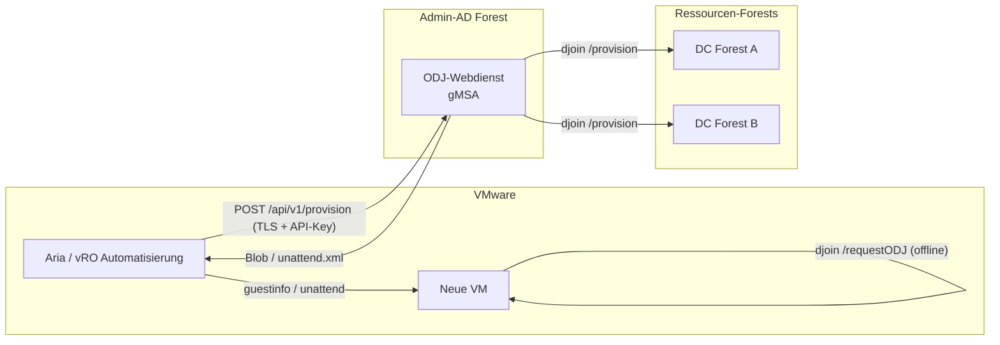

# CrossForestOfflineJoin

Author: Jan Tiedemann

**CrossForestOfflineJoin** ist eine Loesung fuer den automatisierten
Domaenenbeitritt neuer VMware-VMs in **mehrere vertraute AD-Gesamtstrukturen**
aus einem zentralen **Admin-AD-Forest** heraus — ohne das Double-Hop-Problem und
ohne Anmeldeinformationen auf der Ziel-VM.

> Sprachen / Languages: **Deutsch** (diese Datei) &middot; [English](docs/README.en.md)
>
> Schnellstart mit allen Voraussetzungen: [docs/schnellstart.md](docs/schnellstart.md) (DE) &middot; [docs/quickstart.md](docs/quickstart.md) (EN)

## Problem

VMware erstellt neue VMs. Diese sollen aus einer PowerShell-Session auf einem
Admin-AD-Server in die jeweilige Ziel-Domaene der Ressourcen-Forests aufgenommen
werden. Ein interaktiver Remote-Join scheitert am **Double-Hop-Problem**: Die
Anmeldeinformation des Admin-Kontos wird nicht an den Ziel-DC (zweiter Hop)
weitergereicht.

## Loesungsansatz

Statt eines interaktiven Remote-Joins wird **Offline Domain Join (djoin)**
verwendet und in einem **gMSA-Webdienst** gekapselt:

1. Der Dienst legt das Computerkonto **serverseitig** unter seiner **eigenen**
   gMSA-Identitaet an (Cross-Forest-OU-Delegierung) und erzeugt einen
   Base64-**Blob**.
2. VMware injiziert den Blob in die neue VM (per `guestinfo` oder unattend.xml).
3. Die VM wendet den Blob **offline** an — kein DC-Kontakt, keine Credentials.

Damit **entfaellt das Double-Hop-Problem konstruktiv**: Es werden zu keinem
Zeitpunkt Benutzer-Anmeldeinformationen ueber einen zweiten Hop weitergereicht.

Eine ausfuehrliche Bewertung aller Varianten (CredSSP, KCD, RBCD, ODJ, Webdienst)
steht in [docs/loesungsvarianten.md](docs/loesungsvarianten.md).

## Architektur



## Projektstruktur

```text
OfflineJoinService/
|-- README.md
|-- docs/
|   `-- loesungsvarianten.md          # Variantenvergleich + Double-Hop-Analyse
|-- src/
|   |-- OfflineJoin/                   # Kernmodul (djoin-Kapselung)
|   |   |-- OfflineJoin.psd1
|   |   `-- OfflineJoin.psm1
|   `-- WebService/                    # REST-Dienst (Pode)
|       |-- Start-OfflineJoinService.ps1
|       `-- appsettings.psd1
`-- scripts/
    |-- New-OfflineJoinGmsa.ps1        # gMSA anlegen
    |-- Set-CrossForestOuDelegation.ps1# OU-Delegierung im Zielforest
    |-- New-OfflineDomainJoinBlob.ps1  # Blob per CLI erzeugen
    `-- Invoke-OfflineDomainJoinRequest.ps1 # Blob auf der VM anwenden (First-Boot)
```

### Projektressourcen im Ueberblick

| Datei | Typ | Zweck |
|-------|-----|-------|
| [README.md](README.md) | Doku | Diese Uebersicht (Deutsch): Problem, Loesung, Architektur, Einrichtung. |
| [docs/README.en.md](docs/README.en.md) | Doku | Englische Fassung dieser Uebersicht. |
| [docs/loesungsvarianten.md](docs/loesungsvarianten.md) | Doku | Variantenvergleich (CredSSP/KCD/RBCD/ODJ/Webdienst) + Double-Hop-Analyse (Deutsch). |
| [docs/solution-variants.md](docs/solution-variants.md) | Doku | Englische Fassung des Variantenvergleichs. |
| [docs/schnellstart.md](docs/schnellstart.md) | Doku | Installations-Schnellstart mit allen Voraussetzungen (Deutsch). |
| [docs/quickstart.md](docs/quickstart.md) | Doku | Installations-Schnellstart mit allen Voraussetzungen (Englisch). |
| [src/OfflineJoin/OfflineJoin.psd1](src/OfflineJoin/OfflineJoin.psd1) | Modul-Manifest | Metadaten und Export der Kernfunktionen. |
| [src/OfflineJoin/OfflineJoin.psm1](src/OfflineJoin/OfflineJoin.psm1) | Modul | Kapselt `djoin`: Eingabevalidierung, Blob-Erzeugung, unattend-Fragment. |
| [src/WebService/Start-OfflineJoinService.ps1](src/WebService/Start-OfflineJoinService.ps1) | Dienst | Pode-REST-Dienst `POST /api/v1/provision` (TLS, API-Key, Allow-List, Audit). |
| [src/WebService/appsettings.psd1](src/WebService/appsettings.psd1) | Konfiguration | Endpunkt, API-Client-Hashes, Positivliste, Auditpfad. |
| [scripts/New-OfflineJoinGmsa.ps1](scripts/New-OfflineJoinGmsa.ps1) | Skript | Legt die gMSA-Dienstidentitaet im Admin-AD-Forest an. |
| [scripts/Set-CrossForestOuDelegation.ps1](scripts/Set-CrossForestOuDelegation.ps1) | Skript | Delegiert der gMSA je Ziel-OU im Ressourcen-Forest die minimalen Rechte. |
| [scripts/New-OfflineDomainJoinBlob.ps1](scripts/New-OfflineDomainJoinBlob.ps1) | Skript | Erzeugt einen ODJ-Blob per CLI (ohne Webdienst). |
| [scripts/Invoke-OfflineDomainJoinRequest.ps1](scripts/Invoke-OfflineDomainJoinRequest.ps1) | Skript | Wendet den Blob auf der Ziel-VM an (First-Boot, offline). |

### Skripte im Ueberblick

| Skript | Wofuer / Was es tut | Wo ausfuehren | Wann | Wichtige Parameter |
|--------|---------------------|---------------|------|--------------------|
| [New-OfflineJoinGmsa.ps1](scripts/New-OfflineJoinGmsa.ps1) | Legt die **gMSA-Dienstidentitaet** an, unter der der ODJ-Webdienst laeuft. Die gMSA erhaelt bewusst **keine** erhoehten Rechte — diese werden spaeter je Ziel-OU delegiert. | Admin-AD-Forest (DC bzw. Host mit RSAT) | Einmalig bei der Einrichtung | `-Name`, `-Dns`, `-PrincipalsAllowedToRetrieveManagedPassword` |
| [Set-CrossForestOuDelegation.ps1](scripts/Set-CrossForestOuDelegation.ps1) | Delegiert der gMSA in der **Ziel-OU** die **minimalen Rechte** fuer `djoin /provision`: Computerkonten anlegen, Kennwort zuruecksetzen, Kontobeschraenkungen/DNS-Name/SPN schreiben. Least Privilege — nur die OU, nicht die Domaene. | Jeweiliger **Ressourcen-Forest** (Zielforest) | Einmalig je Ziel-OU/Forest | `-TargetOU`, `-TrusteeSamAccountName` |
| [New-OfflineDomainJoinBlob.ps1](scripts/New-OfflineDomainJoinBlob.ps1) | Erzeugt einen **ODJ-Blob** per CLI (duenner Wrapper um die Modulfunktion) — ohne den Webdienst. Ausgabe wahlweise als Roh-Blob, unattend.xml-Fragment oder Metadaten-Objekt. | Admin-AD-Server | Pro neuer VM (manuell/geskriptet, Alternative zum Webdienst) | `-Domain`, `-MachineName`, `-MachineOU`, `-OutputFormat` |
| [Invoke-OfflineDomainJoinRequest.ps1](scripts/Invoke-OfflineDomainJoinRequest.ps1) | Wendet den Blob **offline** auf der neuen VM an (`djoin /requestODJ`) — **ohne DC-Kontakt und ohne Anmeldeinformationen**. Liest den Blob aus Datei oder VMware-`guestinfo`. | Ziel-VM (First-Boot) | Beim ersten Start der neuen VM | `-BlobPath` **oder** `-GuestInfoKey`, `-NoReboot` |

## Voraussetzungen

- Gesamtstruktur-Vertrauensstellungen zwischen Admin-AD und den
  Ressourcen-Forests.
- KDS-Rootkey im Admin-AD-Forest (`Add-KdsRootKey`).
- PowerShell 5.1+, RSAT-Modul `ActiveDirectory`.
- Fuer den Webdienst: Modul `Pode` (`Install-Module Pode`) und ein
  Server-TLS-Zertifikat.
- VMware Tools auf der Ziel-VM (fuer die `guestinfo`-Variante).

## Einrichtung

> Fuer eine vollstaendige, schrittweise Anleitung inklusive aller
> Voraussetzungen siehe den Schnellstart: [docs/schnellstart.md](docs/schnellstart.md).
>
> Hosting-Hinweis: Pode hostet HTTPS selbst — **IIS ist nicht erforderlich**.
> Wer IIS bevorzugt, kann es als Reverse Proxy vor Pode betreiben; siehe
> [Hosting-Alternative: Windows Server mit IIS](docs/schnellstart.md#hosting-alternative-windows-server-mit-iis).

### 1. gMSA im Admin-AD-Forest anlegen

```powershell
.\scripts\New-OfflineJoinGmsa.ps1 `
    -Name 'gmsa-odjsvc' `
    -Dns 'gmsa-odjsvc.admin-ad.example.com' `
    -PrincipalsAllowedToRetrieveManagedPassword 'GG-ODJ-Hosts'
```

Auf den Hostservern anschliessend `Install-ADServiceAccount -Identity 'gmsa-odjsvc'`.

### 2. OU-Delegierung je Ressourcen-Forest setzen

Im jeweiligen **Zielforest** ausfuehren:

```powershell
.\scripts\Set-CrossForestOuDelegation.ps1 `
    -TargetOU 'OU=Server,DC=res-a,DC=example,DC=com' `
    -TrusteeSamAccountName 'ADMIN-AD\gmsa-odjsvc$'
```

### 3. Webdienst konfigurieren und starten

`src/WebService/appsettings.psd1` anpassen (Zertifikat-Thumbprint,
API-Schluessel-Hash, Positivliste). Dann:

```powershell
.\src\WebService\Start-OfflineJoinService.ps1
```

Als Windows-Dienst unter der gMSA registrieren (z. B. per `nssm`).

## Nutzung

### Ueber die CLI (ohne Webdienst)

```powershell
.\scripts\New-OfflineDomainJoinBlob.ps1 `
    -Domain 'res-a.example.com' `
    -MachineName 'RESA-WEB01' `
    -MachineOU 'OU=Server,DC=res-a,DC=example,DC=com' `
    -OutputFormat Blob
```

### Ueber den Webdienst

```powershell
$headers = @{ 'X-Api-Key' = 'MEIN-API-KEY' }
$body = @{ machineName = 'RESA-WEB01'; domain = 'res-a.example.com'; outputFormat = 'blob' } | ConvertTo-Json

Invoke-RestMethod -Method Post `
    -Uri 'https://odjsvc.admin-ad.example.com:8443/api/v1/provision' `
    -Headers $headers -Body $body -ContentType 'application/json'
```

### Blob auf der Ziel-VM anwenden (First-Boot)

```powershell
# Aus VMware-guestinfo-Variable:
.\scripts\Invoke-OfflineDomainJoinRequest.ps1 -GuestInfoKey 'guestinfo.odjblob'

# Oder aus Datei:
.\scripts\Invoke-OfflineDomainJoinRequest.ps1 -BlobPath 'C:\Temp\odj.blob'
```

Alternativ den Blob als `outputFormat=unattend` beziehen und das XML-Fragment in
die unattend.xml der VMware-Vorlage (Pass `offlineServicing`) einbetten.

## Sicherheit

- **Least Privilege:** gMSA erhaelt nur je Ziel-OU das Recht, Computerkonten
  anzulegen und Kennwoerter zurueckzusetzen — keine Domaenen-Admin-Rechte.
- **Blob = Geheimnis:** enthaelt das Maschinenkennwort. Nur ueber TLS
  uebertragen, kurzlebig halten, temporaere Dateien sicher loeschen.
- **API-Absicherung:** HTTPS, API-Schluessel (als SHA256-Hash gespeichert),
  Positivliste, strenge Eingabevalidierung (Injection-Schutz), Auditprotokoll
  ohne Geheimnisinhalte.
- **CredSSP wird nicht verwendet.**

## See Also

- [docs/schnellstart.md](docs/schnellstart.md) &middot; [docs/quickstart.md](docs/quickstart.md)
- [docs/loesungsvarianten.md](docs/loesungsvarianten.md) &middot; [docs/solution-variants.md](docs/solution-variants.md)
- [docs/README.en.md](docs/README.en.md)

### Offizielle Microsoft-Dokumentation (Offline Domain Join / djoin)

- [DirectAccess Offline Domain Join (Uebersicht + djoin /provision, /requestODJ)](https://learn.microsoft.com/windows-server/remote/remote-access/directaccess/directaccess-offline-domain-join)
- [Offline Domain Join (Djoin.exe) Step-by-Step Guide](https://learn.microsoft.com/previous-versions/windows/it-pro/windows-server-2008-R2-and-2008/dd392267(v=ws.10))
- [NetProvisionComputerAccount function (djoin /provision, Blob-Erzeugung)](https://learn.microsoft.com/windows/win32/api/lmjoin/nf-lmjoin-netprovisioncomputeraccount)
- [NetRequestOfflineDomainJoin function (djoin /requestODJ, Blob-Anwendung)](https://learn.microsoft.com/windows/win32/api/lmjoin/nf-lmjoin-netrequestofflinedomainjoin)

## Aenderungshistorie

Siehe [CHANGELOG.md](CHANGELOG.md).

## Lizenz

MIT-Lizenz — siehe [LICENSE](LICENSE).
