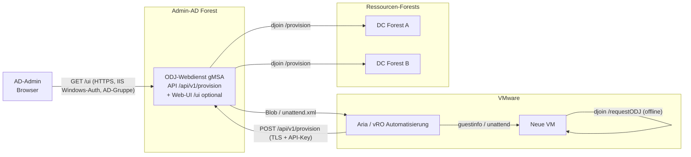

# CrossForestOfflineJoin

Author: Jan Tiedemann

[](https://github.com/BetaHydri/CrossForestOfflineJoin/releases/latest)
[](LICENSE)
[](https://learn.microsoft.com/powershell/)

> Die Versionsangabe oben ist **dynamisch** und zeigt stets das aktuellste
> veroeffentlichte Release; ein Klick fuehrt zur
> [Release-Uebersicht](https://github.com/BetaHydri/CrossForestOfflineJoin/releases).

**CrossForestOfflineJoin** ist eine Loesung fuer den automatisierten
Domaenenbeitritt neuer VMware-VMs in **mehrere vertraute AD-Gesamtstrukturen**
aus einem zentralen **Admin-AD-Forest** heraus — ohne das Double-Hop-Problem und
ohne Anmeldeinformationen auf der Ziel-VM.

> Sprachen / Languages: **Deutsch** (diese Datei) &middot; [English](docs/README.en.md)
>
> Schnellstart mit allen Voraussetzungen: [docs/schnellstart.md](docs/schnellstart.md) (DE) &middot; [docs/quickstart.md](docs/quickstart.md) (EN)

## Problem

VMware erstellt neue VMs. Diese sollen aus einer PowerShell-Session auf einem
Admin-AD-Server in die jeweilige Ziel-Domaene der Ressourcen-Forests aufgenommen
werden. Ein interaktiver Remote-Join scheitert am **Double-Hop-Problem**: Die
Anmeldeinformation des Admin-Kontos wird nicht an den Ziel-DC (zweiter Hop)
weitergereicht.

## Loesungsansatz

Statt eines interaktiven Remote-Joins wird **Offline Domain Join (djoin)**
verwendet und in einem **gMSA-Webdienst** gekapselt:

1. Der Dienst legt das Computerkonto **serverseitig** unter seiner **eigenen**
   gMSA-Identitaet an (Cross-Forest-OU-Delegierung) und erzeugt einen
   Base64-**Blob**.
2. Die Plattform/Automatisierung injiziert den Blob in die neue VM bzw. den
   Zielrechner (z. B. VMware `guestinfo`, unattend.xml oder cloud-init).
3. Die VM wendet den Blob **offline** an — kein DC-Kontakt, keine Credentials.

Damit **entfaellt das Double-Hop-Problem konstruktiv**: Es werden zu keinem
Zeitpunkt Benutzer-Anmeldeinformationen ueber einen zweiten Hop weitergereicht.

Eine ausfuehrliche Bewertung aller Varianten (CredSSP, KCD, RBCD, ODJ, Webdienst)
steht in [docs/loesungsvarianten.md](docs/loesungsvarianten.md).

## Architektur



> **Plattformunabhaengig — VMware ist nur ein Beispiel.** Die Loesung ist nicht
> an VMware gebunden. Der Kern ist der **serverseitig erzeugte ODJ-Blob** und
> dessen **Offline-Anwendung** auf dem Zielrechner; VMware `guestinfo` ist nur
> *eine* Moeglichkeit, den Blob auszuliefern. Geeignet ist jede Plattform, die
> (1) den Blob per REST-API oder CLI anfordern und (2) auf das Ziel bringen kann
> — z. B. **Hyper-V/SCVMM**, **Nutanix AHV**, **Proxmox/KVM**, **physische
> Rechner** (MDT/SCCM/OSD), **Cloud-VMs** (Azure/AWS/GCP) sowie Tools wie
> **Packer**, **Terraform**, **Ansible** oder **cloud-init/unattend.xml**. Da der
> Join offline erfolgt, funktioniert auch ein Ziel **ohne AD-Konnektivitaet** zum
> Zeitpunkt der Bereitstellung.

## Projektstruktur

```text
OfflineJoinService/
|-- README.md
|-- install.ps1                        # Automatisierter Installer (optional)
|-- docs/
|   |-- README.md                      # Doku-Index (Inhaltsverzeichnis)
|   `-- loesungsvarianten.md          # Variantenvergleich + Double-Hop-Analyse
|-- src/
|   |-- README.md                      # Quellcode-Index
|   |-- OfflineJoin/                   # Kernmodul (djoin-Kapselung)
|   |   |-- OfflineJoin.psd1
|   |   `-- OfflineJoin.psm1
|   `-- WebService/                    # REST-Dienst (Pode)
|       |-- Start-OfflineJoinService.ps1
|       |-- OfflineJoinWebUi.ps1        # HTML-Bausteine der optionalen Web-UI
|       `-- appsettings.psd1
|-- tests/                             # Pester-5-Tests (Unit)
`-- scripts/
    |-- New-OfflineJoinGmsa.ps1        # gMSA anlegen
    |-- Set-CrossForestOuDelegation.ps1# OU-Delegierung im Zielforest
    |-- New-OfflineDomainJoinBlob.ps1  # Blob per CLI erzeugen
    `-- Invoke-OfflineDomainJoinRequest.ps1 # Blob auf der VM anwenden (First-Boot)
```

### Projektressourcen im Ueberblick

| Datei | Typ | Zweck |
|-------|-----|-------|
| [README.md](README.md) | Doku | Diese Uebersicht (Deutsch): Problem, Loesung, Architektur, Einrichtung. |
| [docs/README.md](docs/README.md) | Doku-Index | Inhaltsverzeichnis der `docs/`-Dokumente (Sprache + Inhalt). |
| [src/README.md](src/README.md) | Quellcode-Index | Inhaltsverzeichnis des `src/`-Quellcodes (Modul + Webdienst). |
| [install.ps1](install.ps1) | Installer | Automatisierter, wiederholbarer 9-Stufen-Installer (Voraussetzungen, Pode, KDS-Key, Hosts-Gruppe, gMSA, OU-Delegierung, Konfiguration, Dienstregistrierung). Optionen `-EnableWebUi`, `-WebUiAdminGroup`, `-WebUiBasePath`. |
| [docs/README.en.md](docs/README.en.md) | Doku | Englische Fassung dieser Uebersicht. |
| [docs/loesungsvarianten.md](docs/loesungsvarianten.md) | Doku | Variantenvergleich (CredSSP/KCD/RBCD/ODJ/Webdienst) + Double-Hop-Analyse (Deutsch). |
| [docs/solution-variants.md](docs/solution-variants.md) | Doku | Englische Fassung des Variantenvergleichs. |
| [docs/schnellstart.md](docs/schnellstart.md) | Doku | Installations-Schnellstart mit allen Voraussetzungen (Deutsch). |
| [docs/quickstart.md](docs/quickstart.md) | Doku | Installations-Schnellstart mit allen Voraussetzungen (Englisch). |
| [src/OfflineJoin/OfflineJoin.psd1](src/OfflineJoin/OfflineJoin.psd1) | Modul-Manifest | Metadaten und Export der Kernfunktionen. |
| [src/OfflineJoin/OfflineJoin.psm1](src/OfflineJoin/OfflineJoin.psm1) | Modul | Kapselt `djoin`: Eingabevalidierung, Blob-Erzeugung, unattend-Fragment. |
| [src/WebService/Start-OfflineJoinService.ps1](src/WebService/Start-OfflineJoinService.ps1) | Dienst | Pode-REST-Dienst `POST /api/v1/provision` (TLS, API-Key, Allow-List, Audit) plus optionale Web-UI `GET /ui`. |
| [src/WebService/OfflineJoinWebUi.ps1](src/WebService/OfflineJoinWebUi.ps1) | Dienst-Baustein | HTML-Bausteine der Web-UI (getrennt, damit unabhaengig testbar; HTML-Encoding gegen XSS). |
| [src/WebService/appsettings.psd1](src/WebService/appsettings.psd1) | Konfiguration | Endpunkt, API-Client-Hashes, Positivliste, Auditpfad, `WebUi`-Block. |
| [scripts/New-OfflineJoinGmsa.ps1](scripts/New-OfflineJoinGmsa.ps1) | Skript | Legt die gMSA-Dienstidentitaet im Admin-AD-Forest an. |
| [scripts/Set-CrossForestOuDelegation.ps1](scripts/Set-CrossForestOuDelegation.ps1) | Skript | Delegiert der gMSA je Ziel-OU im Ressourcen-Forest die minimalen Rechte. |
| [scripts/New-OfflineDomainJoinBlob.ps1](scripts/New-OfflineDomainJoinBlob.ps1) | Skript | Erzeugt einen ODJ-Blob per CLI (ohne Webdienst). |
| [scripts/Invoke-OfflineDomainJoinRequest.ps1](scripts/Invoke-OfflineDomainJoinRequest.ps1) | Skript | Wendet den Blob auf der Ziel-VM an (First-Boot, offline). |

### Skripte im Ueberblick

| Skript | Wofuer / Was es tut | Wo ausfuehren | Wann | Wichtige Parameter |
|--------|---------------------|---------------|------|--------------------|
| [New-OfflineJoinGmsa.ps1](scripts/New-OfflineJoinGmsa.ps1) | Legt die **gMSA-Dienstidentitaet** an, unter der der ODJ-Webdienst laeuft. Die gMSA erhaelt bewusst **keine** erhoehten Rechte — diese werden spaeter je Ziel-OU delegiert. | Admin-AD-Forest (DC bzw. Host mit RSAT) | Einmalig bei der Einrichtung | `-Name`, `-Dns`, `-PrincipalsAllowedToRetrieveManagedPassword` |
| [Set-CrossForestOuDelegation.ps1](scripts/Set-CrossForestOuDelegation.ps1) | Delegiert der gMSA in der **Ziel-OU** die **minimalen Rechte** fuer `djoin /provision`: Computerkonten anlegen, Kennwort zuruecksetzen, Kontobeschraenkungen/DNS-Name/SPN schreiben. Least Privilege — nur die OU, nicht die Domaene. | Jeweiliger **Ressourcen-Forest** (Zielforest) | Einmalig je Ziel-OU/Forest | `-TargetOU`, `-TrusteeSamAccountName` |
| [New-OfflineDomainJoinBlob.ps1](scripts/New-OfflineDomainJoinBlob.ps1) | Erzeugt einen **ODJ-Blob** per CLI (duenner Wrapper um die Modulfunktion) — ohne den Webdienst. Ausgabe wahlweise als Roh-Blob, unattend.xml-Fragment oder Metadaten-Objekt. | Admin-AD-Server | Pro neuer VM (manuell/geskriptet, Alternative zum Webdienst) | `-Domain`, `-MachineName`, `-MachineOU`, `-OutputFormat` |
| [Invoke-OfflineDomainJoinRequest.ps1](scripts/Invoke-OfflineDomainJoinRequest.ps1) | Wendet den Blob **offline** auf der neuen VM an (`djoin /requestODJ`) — **ohne DC-Kontakt und ohne Anmeldeinformationen**. Liest den Blob aus Datei oder VMware-`guestinfo`. | Ziel-VM (First-Boot) | Beim ersten Start der neuen VM | `-BlobPath` **oder** `-GuestInfoKey`, `-NoReboot` |

> Die `tests/` enthalten Pester-5-Unit-Tests fuer die Kernfunktionen und die
> HTML-Bausteine der Web-UI. Ausfuehren: `Invoke-Pester -Path ./tests`.

## Voraussetzungen

- Gesamtstruktur-Vertrauensstellungen zwischen Admin-AD und den
  Ressourcen-Forests.
- KDS-Rootkey im Admin-AD-Forest (`Add-KdsRootKey`).
- PowerShell 5.1+, RSAT-Modul `ActiveDirectory`.
- Fuer den Webdienst: Modul `Pode` (`Install-Module Pode`) und ein
  Server-TLS-Zertifikat.
- VMware Tools auf der Ziel-VM (fuer die `guestinfo`-Variante).

## Einrichtung

> Fuer eine vollstaendige, schrittweise Anleitung inklusive aller
> Voraussetzungen siehe den Schnellstart: [docs/schnellstart.md](docs/schnellstart.md).
>
> **Automatisiert:** `install.ps1` richtet die komplette Loesung in einem Lauf
> ein (Voraussetzungen, Pode, KDS-Key, gMSA, OU-Delegierung, Konfiguration,
> Dienstregistrierung). Beispiel inkl. optionaler Web-UI:
> `\.install.ps1 -EnableWebUi -WebUiAdminGroup 'GG-ODJ-WebAdmins'`.
>
> Hosting-Hinweis: Pode hostet HTTPS selbst — **IIS ist nicht erforderlich**.
> Wer IIS bevorzugt, kann es als Reverse Proxy vor Pode betreiben; siehe
> [Hosting-Alternative: Windows Server mit IIS](docs/schnellstart.md#hosting-alternative-windows-server-mit-iis).

### 1. gMSA im Admin-AD-Forest anlegen

```powershell
.\scripts\New-OfflineJoinGmsa.ps1 `
    -Name 'gmsa-odjsvc' `
    -Dns 'gmsa-odjsvc.admin-ad.example.com' `
    -PrincipalsAllowedToRetrieveManagedPassword 'GG-ODJ-Hosts'
```

Auf den Hostservern anschliessend `Install-ADServiceAccount -Identity 'gmsa-odjsvc'`.

### 2. OU-Delegierung je Ressourcen-Forest setzen

Im jeweiligen **Zielforest** ausfuehren:

```powershell
.\scripts\Set-CrossForestOuDelegation.ps1 `
    -TargetOU 'OU=Server,DC=res-a,DC=example,DC=com' `
    -TrusteeSamAccountName 'ADMIN-AD\gmsa-odjsvc$'
```

### 3. Webdienst konfigurieren und starten

`src/WebService/appsettings.psd1` anpassen (Zertifikat-Thumbprint,
API-Schluessel-Hash, Positivliste). Dann:

```powershell
.\src\WebService\Start-OfflineJoinService.ps1
```

Als Windows-Dienst unter der gMSA registrieren (z. B. per `nssm`).

## Nutzung

### Ueber die CLI (ohne Webdienst)

```powershell
.\scripts\New-OfflineDomainJoinBlob.ps1 `
    -Domain 'res-a.example.com' `
    -MachineName 'RESA-WEB01' `
    -MachineOU 'OU=Server,DC=res-a,DC=example,DC=com' `
    -OutputFormat Blob
```

### Ueber den Webdienst

```powershell
$headers = @{ 'X-Api-Key' = 'MEIN-API-KEY' }
$body = @{ machineName = 'RESA-WEB01'; domain = 'res-a.example.com'; outputFormat = 'blob' } | ConvertTo-Json

Invoke-RestMethod -Method Post `
    -Uri 'https://odjsvc.admin-ad.example.com:8443/api/v1/provision' `
    -Headers $headers -Body $body -ContentType 'application/json'
```

### Blob auf der Ziel-VM anwenden (First-Boot)

```powershell
# Aus VMware-guestinfo-Variable:
.\scripts\Invoke-OfflineDomainJoinRequest.ps1 -GuestInfoKey 'guestinfo.odjblob'

# Oder aus Datei:
.\scripts\Invoke-OfflineDomainJoinRequest.ps1 -BlobPath 'C:\Temp\odj.blob'
```

Alternativ den Blob als `outputFormat=unattend` beziehen und das XML-Fragment in
die unattend.xml der VMware-Vorlage (Pass `offlineServicing`) einbetten.

### Ueber die Web-UI fuer AD-Admins (optional)

Fuer manuelle Ad-hoc-Joins kann der Dienst zusaetzlich ein **Browser-Formular**
unter `https://<host>/ui` bereitstellen: ein Aufklappmenue der erlaubten
Domaenen/OU-Ziele, der Admin gibt nur den Computernamen ein. Die Oberflaeche ist
**standardmaessig deaktiviert** und fuer den Betrieb **hinter IIS mit
Windows-Authentifizierung** vorgesehen — beschraenkt auf eine AD-Gruppe
(`WebUi.AdminGroup`), mit CSRF-Token, serverseitiger Neuvalidierung gegen die
Positivliste und HTTPS. Aktivierung ueber den `WebUi`-Block in
`appsettings.psd1` (oder `install.ps1 -EnableWebUi`). Details:
[docs/schnellstart.md#weboberflaeche-fuer-ad-admins-optional](docs/schnellstart.md).

### VMware Aria Automation (vRA / vRO) Anbindung

In einer VMware-Aria-Automatisierung ruft typischerweise **Aria Automation
Orchestrator (vRO, ehemals vRealize Orchestrator)** den Dienst auf, waehrend
**Aria Automation (vRA / VCF Automation, ehemals vRealize Automation)** den
Self-Service-Katalog bereitstellt:

1. vRA startet fuer die neue VM einen Katalog-/Blueprint-Workflow und ruft vRO.
2. vRO ruft per **HTTP-REST-Plug-in** `POST /api/v1/provision`
   (TLS + `X-Api-Key`) auf und erhaelt den Base64-Blob (oder das
   unattend-Fragment) zurueck.
3. vRO schreibt den Blob als `guestinfo`-Variable in die VM (vCenter Advanced
   Setting, z. B. per PowerCLI `New-AdvancedSetting -Name 'guestinfo.odjblob'`
   oder `govc vm.change -e guestinfo.odjblob=...`).
4. Beim First-Boot wendet die VM den Blob offline an
   (`Invoke-OfflineDomainJoinRequest.ps1 -GuestInfoKey 'guestinfo.odjblob'`).

Das Architekturdiagramm oben bildet genau diesen Ablauf ab (Knoten
*Aria / vRO Automatisierung*).

**Referenzen:**

- [VMware Aria Automation (vRA / VCF Automation) – Dokumentation](https://techdocs.broadcom.com/us/en/vmware-cis/aria/aria-automation.html)
- [VMware Aria Automation Orchestrator (vRO) – Dokumentation](https://techdocs.broadcom.com/us/en/vmware-cis/aria/aria-automation-orchestrator.html)
- [VMware vSphere – Dokumentation (guestinfo / VM-Advanced-Settings, VMware Tools)](https://techdocs.broadcom.com/us/en/vmware-cis/vsphere/vsphere/9-1.html)

## Sicherheit

- **Least Privilege:** gMSA erhaelt nur je Ziel-OU das Recht, Computerkonten
  anzulegen und Kennwoerter zurueckzusetzen — keine Domaenen-Admin-Rechte.
- **Blob = Geheimnis:** enthaelt das Maschinenkennwort. Nur ueber TLS
  uebertragen, kurzlebig halten, temporaere Dateien sicher loeschen.
- **API-Absicherung:** HTTPS, API-Schluessel (als SHA256-Hash gespeichert),
  Positivliste, strenge Eingabevalidierung (Injection-Schutz), Auditprotokoll
  ohne Geheimnisinhalte.
- **Web-UI-Absicherung:** nur HTTPS, IIS-Windows-Authentifizierung, Beschraenkung
  auf eine AD-Gruppe (`Add-PodeAuthIIS`), Anti-CSRF-Token, serverseitige
  Neuvalidierung gegen die Positivliste (dem Browser-Aufklappmenue wird nicht
  vertraut), Audit mit angemeldetem Windows-Benutzer.
- **CredSSP wird nicht verwendet.**

## BSI IT-Grundschutz (Deutschland / Public Sector)

Diese Loesung wurde an den Anforderungen der **aktuell geltenden BSI
IT-Grundschutz-Bausteine (Edition 2023)** ausgerichtet und ist damit fuer den
Einsatz bei Behoerden und im oeffentlichen Sektor in Deutschland geeignet. Die
folgende Tabelle ordnet die umgesetzten Sicherheitsmassnahmen den relevanten
IT-Grundschutz-Bausteinen zu.

| Baustein | Titel | Umsetzung in dieser Loesung |
|----------|-------|-----------------------------|
| APP.2.2 | Active Directory Domain Services | Least-Privilege-OU-Delegierung statt Domaenen-Admin, dedizierte gMSA-Dienstidentitaet, Offline Domain Join **ohne** Anmeldeinformationen auf dem Ziel. |
| ORP.4 | Identitaets- und Berechtigungsmanagement | API-Schluessel-Authentifizierung + Autorisierung gegen die Positivliste; Web-UI auf eine AD-Gruppe beschraenkt; gMSA nach dem Least-Privilege-Prinzip. |
| APP.3.1 | Webanwendungen und Webservices | Strenge Eingabevalidierung (Injection-Schutz), Anti-CSRF-Token, HTML-Encoding gegen XSS, serverseitige Neuvalidierung, ausschliesslich TLS. |
| CON.1 | Kryptokonzept | Transport ausschliesslich ueber TLS/HTTPS; API-Schluessel nur als SHA-256-Hash gespeichert; der ODJ-Blob wird als Geheimnis behandelt und kurzlebig gehalten. |
| OPS.1.1.5 | Protokollierung | Auditprotokoll aller sicherheitsrelevanten Ereignisse (ALLOW/DENY/ERROR) mit UTC-Zeitstempel und **ohne** Geheimnisinhalte. |
| CON.8 | Software-Entwicklung | Sichere Entwicklung (OWASP-orientiert), `Set-StrictMode`, `$ErrorActionPreference = 'Stop'`, automatisierte Pester-5-Tests. |
| SYS.1.1 | Allgemeiner Server | Betrieb unter dedizierter gMSA ohne interaktive Anmeldung; Registrierung als Windows-Dienst. |

> **Geteilte Verantwortung.** IT-Grundschutz-Konformitaet ist letztlich eine
> Eigenschaft des **Informationssicherheits-Managementsystems (ISMS) der
> betreibenden Organisation**, nicht eines einzelnen Produkts. Die Loesung
> liefert die technischen Voraussetzungen; in der Verantwortung des Betreibers
> bleiben u. a. die Zertifikats-/Schluesselverwaltung (CON.1), die zentrale
> Protokollierung bzw. SIEM-Anbindung sowie Aufbewahrung und Manipulationsschutz
> der Protokolle (OPS.1.1.5), die Server-Haertung und das Patch-Management
> (SYS.1.1, OPS.1) sowie die Einbindung in das eigene Berechtigungskonzept
> (ORP.4). Fuer den Umgang mit Verschlusssachen (z. B. VS-NfD) ist eine
> gesonderte Freigabe/Bewertung erforderlich.

**Referenzen:**

- [BSI IT-Grundschutz-Kompendium (Edition 2023)](https://www.bsi.bund.de/DE/Themen/Unternehmen-und-Organisationen/Standards-und-Zertifizierung/IT-Grundschutz/IT-Grundschutz-Kompendium/it-grundschutz-kompendium_node.html)
- [IT-Grundschutz-Bausteine (Edition 2023)](https://www.bsi.bund.de/DE/Themen/Unternehmen-und-Organisationen/Standards-und-Zertifizierung/IT-Grundschutz/IT-Grundschutz-Kompendium/IT-Grundschutz-Bausteine/Bausteine_Download_Edition_node.html)
- [BSI IT-Grundschutz (Uebersicht und Methodik / BSI-Standards 200-x)](https://www.bsi.bund.de/DE/Themen/Unternehmen-und-Organisationen/Standards-und-Zertifizierung/IT-Grundschutz/it-grundschutz_node.html)

## See Also

- [docs/schnellstart.md](docs/schnellstart.md) &middot; [docs/quickstart.md](docs/quickstart.md)
- [docs/loesungsvarianten.md](docs/loesungsvarianten.md) &middot; [docs/solution-variants.md](docs/solution-variants.md)
- [docs/README.en.md](docs/README.en.md)

### Offizielle Microsoft-Dokumentation (Offline Domain Join / djoin)

- [DirectAccess Offline Domain Join (Uebersicht + djoin /provision, /requestODJ)](https://learn.microsoft.com/windows-server/remote/remote-access/directaccess/directaccess-offline-domain-join)
- [Offline Domain Join (Djoin.exe) Step-by-Step Guide](https://learn.microsoft.com/previous-versions/windows/it-pro/windows-server-2008-R2-and-2008/dd392267(v=ws.10))
- [NetProvisionComputerAccount function (djoin /provision, Blob-Erzeugung)](https://learn.microsoft.com/windows/win32/api/lmjoin/nf-lmjoin-netprovisioncomputeraccount)
- [NetRequestOfflineDomainJoin function (djoin /requestODJ, Blob-Anwendung)](https://learn.microsoft.com/windows/win32/api/lmjoin/nf-lmjoin-netrequestofflinedomainjoin)

## Aenderungshistorie

Siehe [CHANGELOG.md](CHANGELOG.md).

## Lizenz

MIT-Lizenz — siehe [LICENSE](LICENSE).
