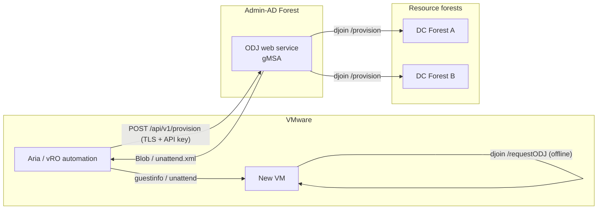

# CrossForestOfflineJoin

Author: Jan Tiedemann

**CrossForestOfflineJoin** is a solution for the automated domain join of new
VMware VMs into **multiple trusted AD forests** from a central **Admin-AD
forest** — without the double-hop problem and without credentials on the target
VM.

> Languages / Sprachen: **English** (this file) &middot; [Deutsch](../README.md)
>
> Quick-start with all prerequisites: [quickstart.md](quickstart.md) (EN) &middot; [schnellstart.md](schnellstart.md) (DE)

## Problem

VMware creates new VMs. They should be joined into the respective target domain
of the resource forests from a PowerShell session on an Admin-AD server. An
interactive remote join fails due to the **double-hop problem**: the credential
of the admin account is not forwarded to the target DC (second hop).

## Approach

Instead of an interactive remote join, **Offline Domain Join (djoin)** is used
and wrapped in a **gMSA web service**:

1. The service creates the computer account **server-side** under its **own**
   gMSA identity (cross-forest OU delegation) and produces a Base64 **blob**.
2. VMware injects the blob into the new VM (via `guestinfo` or unattend.xml).
3. The VM applies the blob **offline** — no DC contact, no credentials.

This **eliminates the double-hop problem by design**: at no point are user
credentials forwarded across a second hop.

A detailed assessment of all variants (CredSSP, KCD, RBCD, ODJ, web service) is
in [solution-variants.md](solution-variants.md).

## Architecture



## Project structure

```text
OfflineJoinService/
|-- README.md                          # German overview
|-- docs/
|   |-- README.en.md                   # English overview (this file)
|   |-- loesungsvarianten.md           # Variant comparison + double-hop analysis (DE)
|   |-- solution-variants.md           # Variant comparison + double-hop analysis (EN)
|   |-- schnellstart.md                # Installation quick-start (DE)
|   `-- quickstart.md                  # Installation quick-start (EN)
|-- src/
|   |-- OfflineJoin/                   # Core module (djoin wrapper)
|   |   |-- OfflineJoin.psd1
|   |   `-- OfflineJoin.psm1
|   `-- WebService/                    # REST service (Pode)
|       |-- Start-OfflineJoinService.ps1
|       `-- appsettings.psd1
`-- scripts/
    |-- New-OfflineJoinGmsa.ps1        # Create gMSA
    |-- Set-CrossForestOuDelegation.ps1# OU delegation in the target forest
    |-- New-OfflineDomainJoinBlob.ps1  # Create blob via CLI
    `-- Invoke-OfflineDomainJoinRequest.ps1 # Apply blob on the VM (first boot)
```

### Project resources at a glance

| File | Type | Purpose |
|------|------|---------|
| [README.md](../README.md) | Docs | German overview: problem, solution, architecture, setup. |
| [docs/README.en.md](README.en.md) | Docs | This English overview. |
| [docs/loesungsvarianten.md](loesungsvarianten.md) | Docs | Variant comparison (CredSSP/KCD/RBCD/ODJ/web service) + double-hop analysis (German). |
| [docs/solution-variants.md](solution-variants.md) | Docs | English version of the variant comparison. |
| [docs/schnellstart.md](schnellstart.md) | Docs | Installation quick-start with all prerequisites (German). |
| [docs/quickstart.md](quickstart.md) | Docs | Installation quick-start with all prerequisites (English). |
| [src/OfflineJoin/OfflineJoin.psd1](../src/OfflineJoin/OfflineJoin.psd1) | Module manifest | Metadata and export of the core functions. |
| [src/OfflineJoin/OfflineJoin.psm1](../src/OfflineJoin/OfflineJoin.psm1) | Module | Wraps `djoin`: input validation, blob creation, unattend fragment. |
| [src/WebService/Start-OfflineJoinService.ps1](../src/WebService/Start-OfflineJoinService.ps1) | Service | Pode REST service `POST /api/v1/provision` (TLS, API key, allow-list, audit). |
| [src/WebService/appsettings.psd1](../src/WebService/appsettings.psd1) | Configuration | Endpoint, API client hashes, allow-list, audit path. |
| [scripts/New-OfflineJoinGmsa.ps1](../scripts/New-OfflineJoinGmsa.ps1) | Script | Creates the gMSA service identity in the Admin-AD forest. |
| [scripts/Set-CrossForestOuDelegation.ps1](../scripts/Set-CrossForestOuDelegation.ps1) | Script | Delegates the minimal rights to the gMSA per target OU in the resource forest. |
| [scripts/New-OfflineDomainJoinBlob.ps1](../scripts/New-OfflineDomainJoinBlob.ps1) | Script | Creates an ODJ blob via CLI (without the web service). |
| [scripts/Invoke-OfflineDomainJoinRequest.ps1](../scripts/Invoke-OfflineDomainJoinRequest.ps1) | Script | Applies the blob on the target VM (first boot, offline). |

### Scripts at a glance

| Script | Purpose / what it does | Where to run | When | Key parameters |
|--------|------------------------|--------------|------|----------------|
| [New-OfflineJoinGmsa.ps1](../scripts/New-OfflineJoinGmsa.ps1) | Creates the **gMSA service identity** the ODJ web service runs under. The gMSA deliberately holds **no** elevated rights — those are delegated later per target OU. | Admin-AD forest (DC or host with RSAT) | Once, during setup | `-Name`, `-Dns`, `-PrincipalsAllowedToRetrieveManagedPassword` |
| [Set-CrossForestOuDelegation.ps1](../scripts/Set-CrossForestOuDelegation.ps1) | Delegates the **minimal rights** for `djoin /provision` to the gMSA on the **target OU**: create computer accounts, reset password, write account restrictions/DNS name/SPN. Least privilege — only the OU, not the domain. | Respective **resource forest** (target forest) | Once per target OU/forest | `-TargetOU`, `-TrusteeSamAccountName` |
| [New-OfflineDomainJoinBlob.ps1](../scripts/New-OfflineDomainJoinBlob.ps1) | Creates an **ODJ blob** via CLI (thin wrapper around the module function) — without the web service. Output as raw blob, unattend.xml fragment or metadata object. | Admin-AD server | Per new VM (manual/scripted, alternative to the web service) | `-Domain`, `-MachineName`, `-MachineOU`, `-OutputFormat` |
| [Invoke-OfflineDomainJoinRequest.ps1](../scripts/Invoke-OfflineDomainJoinRequest.ps1) | Applies the blob **offline** on the new VM (`djoin /requestODJ`) — **no DC contact, no credentials**. Reads the blob from a file or a VMware `guestinfo` variable. | Target VM (first boot) | On first boot of the new VM | `-BlobPath` **or** `-GuestInfoKey`, `-NoReboot` |

## Prerequisites

- Forest trusts between Admin-AD and the resource forests.
- KDS root key in the Admin-AD forest (`Add-KdsRootKey`).
- PowerShell 5.1+, RSAT `ActiveDirectory` module.
- For the web service: the `Pode` module (`Install-Module Pode`) and a server
  TLS certificate.
- VMware Tools on the target VM (for the `guestinfo` variant).

## Setup

> For a complete, step-by-step guide including all prerequisites, see the
> quick-start: [quickstart.md](quickstart.md).
>
> Hosting note: Pode self-hosts HTTPS — **IIS is not required**. If you prefer
> IIS, you can run it as a reverse proxy in front of Pode; see
> [Hosting alternative: Windows Server with IIS](quickstart.md#hosting-alternative-windows-server-with-iis).

### 1. Create the gMSA in the Admin-AD forest

```powershell
.\scripts\New-OfflineJoinGmsa.ps1 `
    -Name 'gmsa-odjsvc' `
    -Dns 'gmsa-odjsvc.admin-ad.example.com' `
    -PrincipalsAllowedToRetrieveManagedPassword 'GG-ODJ-Hosts'
```

Then run `Install-ADServiceAccount -Identity 'gmsa-odjsvc'` on the host servers.

### 2. Set OU delegation per resource forest

Run in the respective **target forest**:

```powershell
.\scripts\Set-CrossForestOuDelegation.ps1 `
    -TargetOU 'OU=Server,DC=res-a,DC=example,DC=com' `
    -TrusteeSamAccountName 'ADMIN-AD\gmsa-odjsvc$'
```

### 3. Configure and start the web service

Adjust `src/WebService/appsettings.psd1` (certificate thumbprint, API key hash,
allow-list). Then:

```powershell
.\src\WebService\Start-OfflineJoinService.ps1
```

Register it as a Windows service under the gMSA (e.g. with `nssm`).

## Usage

### Via the CLI (without the web service)

```powershell
.\scripts\New-OfflineDomainJoinBlob.ps1 `
    -Domain 'res-a.example.com' `
    -MachineName 'RESA-WEB01' `
    -MachineOU 'OU=Server,DC=res-a,DC=example,DC=com' `
    -OutputFormat Blob
```

### Via the web service

```powershell
$headers = @{ 'X-Api-Key' = 'MY-API-KEY' }
$body = @{ machineName = 'RESA-WEB01'; domain = 'res-a.example.com'; outputFormat = 'blob' } | ConvertTo-Json

Invoke-RestMethod -Method Post `
    -Uri 'https://odjsvc.admin-ad.example.com:8443/api/v1/provision' `
    -Headers $headers -Body $body -ContentType 'application/json'
```

### Apply the blob on the target VM (first boot)

```powershell
# From the VMware guestinfo variable:
.\scripts\Invoke-OfflineDomainJoinRequest.ps1 -GuestInfoKey 'guestinfo.odjblob'

# Or from a file:
.\scripts\Invoke-OfflineDomainJoinRequest.ps1 -BlobPath 'C:\Temp\odj.blob'
```

Alternatively, obtain the blob as `outputFormat=unattend` and embed the XML
fragment into the VMware template's unattend.xml (pass `offlineServicing`).

## Security

- **Least privilege:** the gMSA only gets the right to create computer accounts
  and reset passwords per target OU — no domain admin rights.
- **Blob = secret:** it contains the machine password. Transport over TLS only,
  keep it short-lived, securely delete temporary files.
- **API hardening:** HTTPS, API key (stored as a SHA256 hash), allow-list,
  strict input validation (injection protection), audit log without secret
  content.
- **CredSSP is not used.**

## See Also

- [quickstart.md](quickstart.md) &middot; [schnellstart.md](schnellstart.md)
- [solution-variants.md](solution-variants.md) &middot; [loesungsvarianten.md](loesungsvarianten.md)
- [README.md](../README.md)
- [Microsoft Learn: Offline Domain Join (djoin)](https://learn.microsoft.com/windows-server/identity/ad-ds/deploy/offline-domain-join--djoin--step-by-step)

## Changelog

See [CHANGELOG.md](../CHANGELOG.md).

## License

MIT License — see [LICENSE](../LICENSE).
