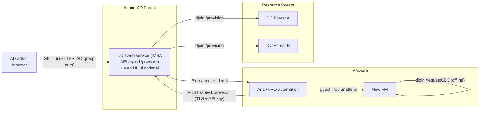

# CrossForestOfflineJoin

Author: Jan Tiedemann

[](https://github.com/BetaHydri/CrossForestOfflineJoin/releases/latest)
[](../LICENSE)
[](https://learn.microsoft.com/powershell/)

> The version badge above is **dynamic** and always shows the latest published
> release; clicking it opens the
> [releases overview](https://github.com/BetaHydri/CrossForestOfflineJoin/releases).

**CrossForestOfflineJoin** is a solution for the automated domain join of new
VMware VMs into **multiple trusted AD forests** from a central **Admin-AD
forest** — without the double-hop problem and without credentials on the target
VM.

> Languages / Sprachen: **English** (this file) &middot; [Deutsch](../README.md)
>
> Quick-start with all prerequisites: [quickstart.md](quickstart.md) (EN) &middot; [schnellstart.md](schnellstart.md) (DE)

> **:cloud: Multi-cloud (Azure/AWS/GCP) with Bicep, Terraform & Ansible.**
> The service joins new Windows VMs on **any** platform offline and without
> credentials on the target. Ready-made examples with Mermaid diagrams:
> **[multi-cloud.en.md](multi-cloud.en.md)** (EN) &middot; [multi-cloud.md](multi-cloud.md) (DE).

## Problem

VMware creates new VMs. They should be joined into the respective target domain
of the resource forests from a PowerShell session on an Admin-AD server. An
interactive remote join fails due to the **double-hop problem**: the credential
of the admin account is not forwarded to the target DC (second hop).

## Approach

Instead of an interactive remote join, **Offline Domain Join (djoin)** is used
and wrapped in a **gMSA web service**:

1. The service creates the computer account **server-side** under its **own**
   gMSA identity (cross-forest OU delegation) and produces a Base64 **blob**.
2. The platform/automation injects the blob into the new VM or target machine
   (e.g. VMware `guestinfo`, unattend.xml or cloud-init).
3. The VM applies the blob **offline** — no DC contact, no credentials.

This **eliminates the double-hop problem by design**: at no point are user
credentials forwarded across a second hop.

A detailed assessment of all variants (CredSSP, KCD, RBCD, ODJ, web service) is
in [solution-variants.md](solution-variants.md).

## Architecture



> **Platform-independent — VMware is only an example.** The solution is not tied
> to VMware. Its core is the **server-side ODJ blob** and its **offline
> application** on the target machine; VMware `guestinfo` is only *one* way to
> deliver the blob. Any platform works that can (1) request the blob via the REST
> API or CLI and (2) deliver it to the target — e.g. **Hyper-V/SCVMM**, **Nutanix
> AHV**, **Proxmox/KVM**, **physical machines** (MDT/SCCM/OSD), **cloud VMs**
> (Azure/AWS/GCP), and tools such as **Packer**, **Terraform**, **Ansible** or
> **cloud-init/unattend.xml**. Because the join happens offline, a target
> **without AD connectivity** at provisioning time also works. Concrete
> **multi-cloud VM** examples (Azure/AWS/GCP) with **Bicep, Terraform and
> Ansible**, including Mermaid diagrams: [multi-cloud.en.md](multi-cloud.en.md).

## Project structure

```text
OfflineJoinService/
|-- README.md                          # German overview
|-- install.ps1                        # Automated installer (optional)
|-- docs/
|   |-- README.md                      # Docs index (table of contents)
|   |-- README.en.md                   # English overview (this file)
|   |-- loesungsvarianten.md           # Variant comparison + double-hop analysis (DE)
|   |-- solution-variants.md           # Variant comparison + double-hop analysis (EN)
|   |-- schnellstart.md                # Installation quick-start (DE)
|   `-- quickstart.md                  # Installation quick-start (EN)
|-- src/
|   |-- README.md                      # Source index
|   |-- OfflineJoin/                   # Core module (djoin wrapper)
|   |   |-- OfflineJoin.psd1
|   |   `-- OfflineJoin.psm1
|   `-- WebService/                    # REST service (Pode)
|       |-- Start-OfflineJoinService.ps1
|       |-- OfflineJoinWebUi.ps1        # HTML builders for the optional web UI
|       |-- OfflineJoinLogging.ps1      # Structured audit logging (OPS.1.1.5)
|       `-- appsettings.psd1
|-- tests/                             # Pester 5 tests (unit)
`-- scripts/
    |-- New-OfflineJoinGmsa.ps1        # Create gMSA
    |-- Set-CrossForestOuDelegation.ps1# OU delegation in the target forest
    |-- New-OfflineDomainJoinBlob.ps1  # Create blob via CLI
    `-- Invoke-OfflineDomainJoinRequest.ps1 # Apply blob on the VM (first boot)
```

### Project resources at a glance

| File | Type | Purpose |
|------|------|---------|
| [README.md](../README.md) | Docs | German overview: problem, solution, architecture, setup. |
| [docs/README.md](README.md) | Docs index | Table of contents for the `docs/` documents (language + content). |
| [src/README.md](../src/README.md) | Source index | Table of contents for the `src/` source (module + web service). |
| [install.ps1](../install.ps1) | Installer | Automated, re-runnable 9-stage installer (prerequisites, Pode, KDS key, hosts group, gMSA, OU delegation, config, service registration). Options `-EnableWebUi`, `-WebUiAdminGroup`, `-CreateWebUiAdminGroup`, `-WebUiBasePath`, `-EnableEventLog`, `-EventLogName`, `-EventLogSource`. |
| [docs/README.en.md](README.en.md) | Docs | This English overview. |
| [docs/loesungsvarianten.md](loesungsvarianten.md) | Docs | Variant comparison (CredSSP/KCD/RBCD/ODJ/web service) + double-hop analysis (German). |
| [docs/solution-variants.md](solution-variants.md) | Docs | English version of the variant comparison. |
| [docs/schnellstart.md](schnellstart.md) | Docs | Installation quick-start with all prerequisites (German). |
| [docs/quickstart.md](quickstart.md) | Docs | Installation quick-start with all prerequisites (English). |
| [src/OfflineJoin/OfflineJoin.psd1](../src/OfflineJoin/OfflineJoin.psd1) | Module manifest | Metadata and export of the core functions. |
| [src/OfflineJoin/OfflineJoin.psm1](../src/OfflineJoin/OfflineJoin.psm1) | Module | Wraps `djoin`: input validation, blob creation, unattend fragment. |
| [src/WebService/Start-OfflineJoinService.ps1](../src/WebService/Start-OfflineJoinService.ps1) | Service | Pode REST service `POST /api/v1/provision` (TLS, API key, allow-list, audit) plus optional web UI `GET /ui`. |
| [src/WebService/OfflineJoinWebUi.ps1](../src/WebService/OfflineJoinWebUi.ps1) | Service component | HTML builders for the web UI (separated so they can be unit-tested; HTML-encoding against XSS). |
| [src/WebService/OfflineJoinLogging.ps1](../src/WebService/OfflineJoinLogging.ps1) | Service component | Structured, injection-safe audit logging (OPS.1.1.5): pure line formatter plus file and optional Windows Event Log writer. |
| [src/WebService/appsettings.psd1](../src/WebService/appsettings.psd1) | Configuration | Endpoint, API client hashes, allow-list, audit path, `WebUi` block, optional `Logging`/`EventLog` block. |
| [scripts/New-OfflineJoinGmsa.ps1](../scripts/New-OfflineJoinGmsa.ps1) | Script | Creates the gMSA service identity in the Admin-AD forest. |
| [scripts/Set-CrossForestOuDelegation.ps1](../scripts/Set-CrossForestOuDelegation.ps1) | Script | Delegates the minimal rights to the gMSA per target OU in the resource forest. |
| [scripts/New-OfflineDomainJoinBlob.ps1](../scripts/New-OfflineDomainJoinBlob.ps1) | Script | Creates an ODJ blob via CLI (without the web service). |
| [scripts/Invoke-OfflineDomainJoinRequest.ps1](../scripts/Invoke-OfflineDomainJoinRequest.ps1) | Script | Applies the blob on the target VM (first boot, offline). |

### Scripts at a glance

| Script | Purpose / what it does | Where to run | When | Key parameters |
|--------|------------------------|--------------|------|----------------|
| [New-OfflineJoinGmsa.ps1](../scripts/New-OfflineJoinGmsa.ps1) | Creates the **gMSA service identity** the ODJ web service runs under. The gMSA deliberately holds **no** elevated rights — those are delegated later per target OU. | Admin-AD forest (DC or host with RSAT) | Once, during setup | `-Name`, `-Dns`, `-PrincipalsAllowedToRetrieveManagedPassword` |
| [Set-CrossForestOuDelegation.ps1](../scripts/Set-CrossForestOuDelegation.ps1) | Delegates the **minimal rights** for `djoin /provision` to the gMSA on the **target OU**: create computer accounts, reset password, write account restrictions/DNS name/SPN. Least privilege — only the OU, not the domain. | Respective **resource forest** (target forest) | Once per target OU/forest | `-TargetOU`, `-TrusteeSamAccountName` |
| [New-OfflineDomainJoinBlob.ps1](../scripts/New-OfflineDomainJoinBlob.ps1) | Creates an **ODJ blob** via CLI (thin wrapper around the module function) — without the web service. Output as raw blob, unattend.xml fragment or metadata object. | Admin-AD server | Per new VM (manual/scripted, alternative to the web service) | `-Domain`, `-MachineName`, `-MachineOU`, `-OutputFormat` |
| [Invoke-OfflineDomainJoinRequest.ps1](../scripts/Invoke-OfflineDomainJoinRequest.ps1) | Applies the blob **offline** on the new VM (`djoin /requestODJ`) — **no DC contact, no credentials**. Reads the blob from a file or a VMware `guestinfo` variable. | Target VM (first boot) | On first boot of the new VM | `-BlobPath` **or** `-GuestInfoKey`, `-NoReboot` |

> The `tests/` folder holds Pester 5 unit tests for the core functions and the
> web-UI HTML builders. Run them with `Invoke-Pester -Path ./tests`.

## Prerequisites

- Forest trusts between Admin-AD and the resource forests.
- KDS root key in the Admin-AD forest (`Add-KdsRootKey`).
- PowerShell 5.1+, RSAT `ActiveDirectory` module.
- For the web service: the `Pode` module (`Install-Module Pode`) and a server
  TLS certificate.
- VMware Tools on the target VM (for the `guestinfo` variant).

## Setup

> For a complete, step-by-step guide including all prerequisites, see the
> quick-start: [quickstart.md](quickstart.md).
>
> **Automated:** `install.ps1` sets up the whole solution in one run
> (prerequisites, Pode, KDS key, gMSA, OU delegation, config, service
> registration). Example including the optional web UI:
> `\.install.ps1 -EnableWebUi -WebUiAdminGroup 'GG-ODJ-WebAdmins'`.
>
> Hosting note: Pode self-hosts HTTPS — **IIS is not required**. If you prefer
> IIS, you can run it as a reverse proxy in front of Pode; see
> [Hosting alternative: Windows Server with IIS](quickstart.md#hosting-alternative-windows-server-with-iis).

### 1. Create the gMSA in the Admin-AD forest

```powershell
.\scripts\New-OfflineJoinGmsa.ps1 `
    -Name 'gmsa-odjsvc' `
    -Dns 'gmsa-odjsvc.admin-ad.example.com' `
    -PrincipalsAllowedToRetrieveManagedPassword 'GG-ODJ-Hosts'
```

Then run `Install-ADServiceAccount -Identity 'gmsa-odjsvc'` on the host servers.

### 2. Set OU delegation per resource forest

Run in the respective **target forest**:

```powershell
.\scripts\Set-CrossForestOuDelegation.ps1 `
    -TargetOU 'OU=Server,DC=res-a,DC=example,DC=com' `
    -TrusteeSamAccountName 'ADMIN-AD\gmsa-odjsvc$'
```

### 3. Configure and start the web service

Adjust `src/WebService/appsettings.psd1` (certificate thumbprint, API key hash,
allow-list). Then:

```powershell
.\src\WebService\Start-OfflineJoinService.ps1
```

Register it as a Windows service under the gMSA (e.g. with `nssm`).

## Usage

### Via the CLI (without the web service)

```powershell
.\scripts\New-OfflineDomainJoinBlob.ps1 `
    -Domain 'res-a.example.com' `
    -MachineName 'RESA-WEB01' `
    -MachineOU 'OU=Server,DC=res-a,DC=example,DC=com' `
    -OutputFormat Blob
```

### Via the web service

```powershell
$headers = @{ 'X-Api-Key' = 'MY-API-KEY' }
$body = @{ machineName = 'RESA-WEB01'; domain = 'res-a.example.com'; outputFormat = 'blob' } | ConvertTo-Json

Invoke-RestMethod -Method Post `
    -Uri 'https://odjsvc.admin-ad.example.com:8443/api/v1/provision' `
    -Headers $headers -Body $body -ContentType 'application/json'
```

### Apply the blob on the target VM (first boot)

```powershell
# From the VMware guestinfo variable:
.\scripts\Invoke-OfflineDomainJoinRequest.ps1 -GuestInfoKey 'guestinfo.odjblob'

# Or from a file:
.\scripts\Invoke-OfflineDomainJoinRequest.ps1 -BlobPath 'C:\Temp\odj.blob'
```

Alternatively, obtain the blob as `outputFormat=unattend` and embed the XML
fragment into the VMware template's unattend.xml (pass `offlineServicing`).

### Via the web UI for AD admins (optional)

For manual, ad-hoc joins the service can also serve a **browser form** at
`https://<host>/ui`: a drop-down of the allowed domain/OU targets where the admin
only types the computer name. The form is **disabled by default** and restricted
to an AD group (`WebUi.AdminGroup`), with a CSRF token, server-side re-validation
against the allow-list, and HTTPS. It authenticates admins via `WebUi.AuthMode`:
`'WindowsAd'` (**default**) validates browser-supplied AD credentials directly —
**no IIS required** — or `'IIS'` consumes the Windows identity forwarded by IIS
for Kerberos single sign-on. Enable it via the `WebUi` block in
`appsettings.psd1` (or `install.ps1 -EnableWebUi`). Details:
[quickstart.md#web-ui-for-ad-admins-optional](quickstart.md).

### VMware Aria Automation (vRA / vRO) integration

In a VMware Aria automation, **Aria Automation Orchestrator (vRO, formerly
vRealize Orchestrator)** typically calls the service, while **Aria Automation
(vRA / VCF Automation, formerly vRealize Automation)** provides the self-service
catalog:

1. vRA starts a catalog/blueprint workflow for the new VM and calls vRO.
2. vRO calls `POST /api/v1/provision` (TLS + `X-Api-Key`) via the **HTTP-REST
   plug-in** and receives the Base64 blob (or the unattend fragment) back.
3. vRO writes the blob into the VM as a `guestinfo` variable (a vCenter advanced
   setting, e.g. via PowerCLI `New-AdvancedSetting -Name 'guestinfo.odjblob'` or
   `govc vm.change -e guestinfo.odjblob=...`).
4. On first boot the VM applies the blob offline
   (`Invoke-OfflineDomainJoinRequest.ps1 -GuestInfoKey 'guestinfo.odjblob'`).

The architecture diagram above shows exactly this flow (the *Aria / vRO
automation* node).

**References:**

- [VMware Aria Automation (vRA / VCF Automation) – documentation](https://techdocs.broadcom.com/us/en/vmware-cis/aria/aria-automation.html)
- [VMware Aria Automation Orchestrator (vRO) – documentation](https://techdocs.broadcom.com/us/en/vmware-cis/aria/aria-automation-orchestrator.html)
- [VMware vSphere – documentation (guestinfo / VM advanced settings, VMware Tools)](https://techdocs.broadcom.com/us/en/vmware-cis/vsphere/vsphere/9-1.html)

## Security

- **Least privilege:** the gMSA only gets the right to create computer accounts
  and reset passwords per target OU — no domain admin rights.
- **Blob = secret:** it contains the machine password. Transport over TLS only,
  keep it short-lived, securely delete temporary files.
- **API hardening:** HTTPS, API key (stored as a SHA256 hash), allow-list,
  strict input validation (injection protection), audit log without secret
  content.
- **Logging (OPS.1.1.5):** structured, injection-safe audit log of every
  security-relevant event — successful **and** failed authentication,
  ALLOW/DENY/ERROR, service start/stop — each with a UTC timestamp, source IP
  (including `X-Forwarded-For`) and the authenticated user. Control characters are
  stripped (no log forging). Optionally every event is mirrored to the Windows
  Event Log for central collection (Windows Event Forwarding / SIEM).
- **Web UI hardening:** HTTPS only, AD-group-restricted authentication
  (`WebUi.AuthMode`: standalone `Add-PodeAuthWindowsAd` by default, or
  `Add-PodeAuthIIS` behind IIS), anti-CSRF token, server-side re-validation
  against the allow-list (the browser drop-down is never trusted), audit with the
  authenticated Windows user.
- **CredSSP is not used.**

## BSI IT-Grundschutz (Germany / Public Sector)

This solution was designed in line with the requirements of the **currently
applicable BSI IT-Grundschutz building blocks (Edition 2023)** and is therefore
suitable for use by public-sector organisations and government agencies in
Germany. The table below maps the implemented security measures to the relevant
IT-Grundschutz building blocks.

| Building block | Title | Implementation in this solution |
|----------------|-------|---------------------------------|
| APP.2.2 | Active Directory Domain Services | Least-privilege per-OU delegation instead of domain admin, a dedicated gMSA service identity, Offline Domain Join **without** credentials on the target. |
| ORP.4 | Identity and access management | API-key authentication + authorization against the allow-list; web UI restricted to an AD group; gMSA follows the least-privilege principle. |
| APP.3.1 | Web applications and web services | Strict input validation (injection protection), anti-CSRF token, HTML encoding against XSS, server-side re-validation, TLS only. |
| CON.1 | Cryptographic concept | Transport over TLS/HTTPS only; API key stored only as a SHA-256 hash; the ODJ blob is treated as a secret and kept short-lived. |
| OPS.1.1.5 | Logging | Structured, injection-safe audit log of all security-relevant events (authentication success/failure, ALLOW/DENY/ERROR, service start/stop) with UTC timestamps, source IP (including `X-Forwarded-For`) and user, **without** secret content; optional mirror to the Windows Event Log for central collection (WEF/SIEM). |
| CON.8 | Software development | Secure development (OWASP-oriented), `Set-StrictMode`, `$ErrorActionPreference = 'Stop'`, automated Pester 5 tests. |
| SYS.1.1 | Generic server | Operated under a dedicated gMSA without interactive logon; registered as a Windows service. |

> **Shared responsibility.** IT-Grundschutz conformity is ultimately a property
> of the **operating organisation's information security management system
> (ISMS)**, not of a single product. The solution provides the technical
> prerequisites; the operator remains responsible for, among others, certificate
> and key management (CON.1), central logging / SIEM integration as well as
> retention and tamper protection of the logs (OPS.1.1.5), server hardening and
> patch management (SYS.1.1, OPS.1), and integration into the organisation's own
> authorization concept (ORP.4). Handling classified information (e.g. VS-NfD)
> requires a separate approval/assessment.

**References:**

- [BSI IT-Grundschutz-Kompendium (Edition 2023)](https://www.bsi.bund.de/DE/Themen/Unternehmen-und-Organisationen/Standards-und-Zertifizierung/IT-Grundschutz/IT-Grundschutz-Kompendium/it-grundschutz-kompendium_node.html)
- [IT-Grundschutz building blocks (Edition 2023)](https://www.bsi.bund.de/DE/Themen/Unternehmen-und-Organisationen/Standards-und-Zertifizierung/IT-Grundschutz/IT-Grundschutz-Kompendium/IT-Grundschutz-Bausteine/Bausteine_Download_Edition_node.html)
- [BSI IT-Grundschutz (overview and methodology / BSI Standards 200-x)](https://www.bsi.bund.de/DE/Themen/Unternehmen-und-Organisationen/Standards-und-Zertifizierung/IT-Grundschutz/it-grundschutz_node.html)

## See Also

- [quickstart.md](quickstart.md) &middot; [schnellstart.md](schnellstart.md)
- [solution-variants.md](solution-variants.md) &middot; [loesungsvarianten.md](loesungsvarianten.md)
- [multi-cloud.en.md](multi-cloud.en.md) &middot; [multi-cloud.md](multi-cloud.md)
- [README.md](../README.md)
- [Microsoft Learn: Offline Domain Join (djoin)](https://learn.microsoft.com/windows-server/identity/ad-ds/deploy/offline-domain-join--djoin--step-by-step)

## Changelog

See [CHANGELOG.md](../CHANGELOG.md).

## License

MIT License — see [LICENSE](../LICENSE).
