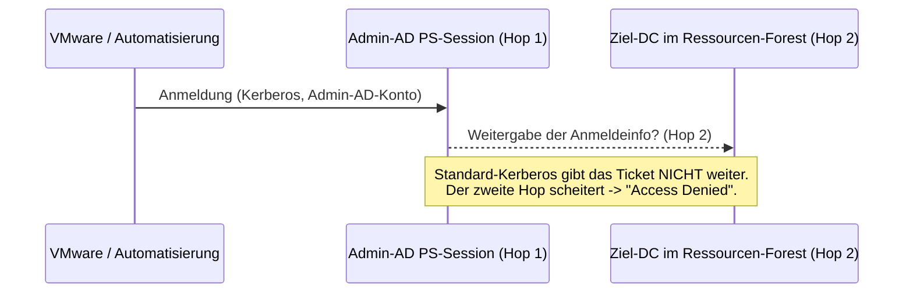
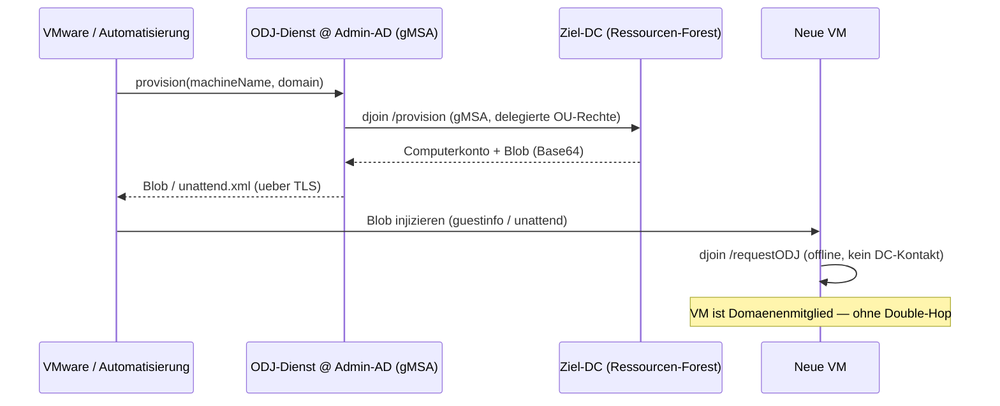

# Loesungsvarianten: VM-Domaenenbeitritt ueber Forest-Grenzen

Author: Jan Tiedemann

> Sprachen / Languages: **Deutsch** (diese Datei) &middot; [English](solution-variants.md)

Diese Datei beschreibt die moeglichen Loesungswege fuer das Problem, neue
VMware-VMs aus einem zentralen Admin-AD-Forest heraus in mehrere vertraute
Ressourcen-Forests aufzunehmen — inklusive Bewertung des Double-Hop-Problems.

## Ausgangslage

- Mehrere AD-Gesamtstrukturen (Ressourcen-Forests) und ein zentraler
  **Admin-AD-Forest**.
- Zwischen Admin-AD und den Ressourcen-Forests bestehen
  **Gesamtstruktur-Vertrauensstellungen** (Forest Trusts).
- VMware (bzw. dessen Automatisierung) meldet sich mit einem **Admin-AD-Konto**
  an einer **PowerShell-Session auf einem Admin-AD-Server** an und soll von dort
  neue VMs in die jeweilige Ziel-Domaene aufnehmen.

## Das Double-Hop-Problem

Bei einer Remote-PowerShell-Session landet die Anmeldeinformation nur auf dem
ersten Server (Admin-AD). Ein weiterer Netzwerkzugriff von dort auf einen
Ziel-DC (zweiter Hop) besitzt standardmaessig **keine delegierbaren
Anmeldeinformationen** — das ist das klassische Double-Hop-Problem.

## Variantenvergleich

| Variante | Loest Double-Hop | Cross-Forest faehig | Sicherheit | Empfehlung |
|----------|------------------|---------------------|------------|------------|
| CredSSP | Ja (unsauber) | Ja | Schwach (Credential-Exposure am 2. Hop) | Nein |
| Kerberos Constrained Delegation (KCD) | Teilweise | Nein (domaenen-gebunden) | Mittel | Nein |
| Resource-Based Constrained Delegation (RBCD) | Ja | Ja (mit Trust, komplex) | Gut | Nur wenn interaktiver Remote-Join zwingend ist |
| **Offline Domain Join (djoin/ODJ)** | **Entfaellt konstruktiv** | **Ja** | **Sehr gut** | **Ja (Basis)** |
| **ODJ + Webdienst (gMSA)** | **Entfaellt konstruktiv** | **Ja** | **Sehr gut** | **Ja (Zielarchitektur)** |

### Variante A — CredSSP (nicht empfohlen)

CredSSP delegiert die (klartextaequivalenten) Anmeldeinformationen an den zweiten
Hop. Damit funktioniert der Remote-Join, aber die Zugangsdaten des Admin-Kontos
liegen am zweiten Server offen an — ein hohes Risiko (Credential Theft,
Pass-the-Hash-Nachfolgeszenarien). **Nicht verwenden.**

### Variante B — Kerberos Constrained Delegation (KCD)

Klassische, dienstseitig konfigurierte Delegierung. Historisch **domaenen-**
**gebunden** und damit **nicht** ueber Forest-Grenzen einsetzbar. Fuer ein
Multi-Forest-Szenario ungeeignet.

### Variante C — Resource-Based Constrained Delegation (RBCD)

RBCD wird auf der **Ressourcenseite** konfiguriert (`msDS-Allowed`
`ToActOnBehalfOfOtherIdentity` bzw. `PrincipalsAllowedToDelegateToAccount`).
Sie funktioniert domaenenuebergreifend und mit Vertrauensstellungen auch
forestuebergreifend (S4U2Proxy ueber den Trust), ist aber aufwendig zu
verwalten und weiterhin auf einen **interaktiven Impersonierungs-Join**
ausgelegt. Nur waehlen, wenn ein echter Remote-Join mit Benutzerkontext
zwingend erforderlich ist.

### Variante D — Offline Domain Join (empfohlene Basis)

`djoin.exe /provision` **entkoppelt** die beiden Schritte:

1. **Kontoerstellung (braucht DC-Zugriff):** laeuft **lokal auf dem
   Admin-AD-Server** unter der **eigenen Identitaet** des Ausfuehrenden
   (idealerweise einer gMSA). Ueber die Cross-Forest-OU-Delegierung darf diese
   Identitaet in der Ziel-OU ein Computerkonto anlegen. Das ist ein **einzelner
   Hop** — kein Weiterreichen von Benutzer-Anmeldeinformationen.
2. **Anwendung auf der VM (kein DC noetig):** der erzeugte Base64-Blob wird
   **out-of-band** zur VM transportiert und dort mit `djoin /requestODJ`
   (bzw. per unattend.xml) angewandt. Die VM kontaktiert **keinen DC** und
   benoetigt **keine Anmeldeinformationen**.

**Damit entfaellt das Double-Hop-Problem vollstaendig**, weil zu keinem
Zeitpunkt Benutzer-Anmeldeinformationen ueber einen zweiten Hop weitergereicht
werden.

### Variante E — ODJ als Webdienst mit gMSA (Zielarchitektur)

Variante D wird in einem **REST-Webdienst** gekapselt (siehe
`src/WebService/Start-OfflineJoinService.ps1`). Der Dienst laeuft unter einer
**gMSA** und bietet genau einen Endpunkt `POST /api/v1/provision`.

Vorteile:

- **Kein Double-Hop:** Der Dienst nutzt seine **eigene** Identitaet, nicht die
  des Aufrufers. Es findet keine Delegierung von Benutzer-Credentials statt.
- **Least Privilege:** Die gMSA hat nur in den delegierten Ziel-OUs das Recht,
  Computerkonten anzulegen — sonst nichts.
- **Saubere Integration in VMware:** vRealize/Aria Automation ruft die API auf,
  injiziert den Blob per `guestinfo` oder unattend.xml in die neue VM.
- **Governance:** Positivliste (Allow-List), API-Schluessel-Auth ueber TLS,
  Auditprotokoll, Eingabevalidierung (Injection-Schutz).

## Empfehlung

1. **Basis:** Offline Domain Join (djoin) statt interaktivem Remote-Join.
2. **Zielarchitektur:** Den ODJ-Vorgang als **gMSA-Webdienst** bereitstellen und
   die Ziel-OUs je Ressourcen-Forest per Delegierung berechtigen.
3. **RBCD** nur als Rueckfalloption, falls ein echter interaktiver Remote-Join
   mit Benutzerkontext unumgaenglich ist.
4. **CredSSP** wird ausdruecklich **nicht** empfohlen.

## Sicherheitshinweise zum Blob

- Der ODJ-Blob enthaelt das **Maschinenkennwort** — er ist ein **Geheimnis**.
- Nur ueber **TLS** uebertragen, **kurzlebig** halten, temporaere Dateien sicher
  loeschen.
- Kontonamen und OUs strikt validieren (Positivliste), um Missbrauch zu
  verhindern.

## See Also

- [README](../README.md)
- [solution-variants.md](solution-variants.md) (English)

### Offizielle Microsoft-Dokumentation (Offline Domain Join / djoin)

- [DirectAccess Offline Domain Join (Uebersicht + djoin /provision, /requestODJ)](https://learn.microsoft.com/windows-server/remote/remote-access/directaccess/directaccess-offline-domain-join)
- [Offline Domain Join (Djoin.exe) Step-by-Step Guide](https://learn.microsoft.com/previous-versions/windows/it-pro/windows-server-2008-R2-and-2008/dd392267(v=ws.10))
- [NetProvisionComputerAccount function (djoin /provision, Blob-Erzeugung)](https://learn.microsoft.com/windows/win32/api/lmjoin/nf-lmjoin-netprovisioncomputeraccount)
- [NetRequestOfflineDomainJoin function (djoin /requestODJ, Blob-Anwendung)](https://learn.microsoft.com/windows/win32/api/lmjoin/nf-lmjoin-netrequestofflinedomainjoin)

### Weitere Referenzen

- [Microsoft Learn: Resource-Based Constrained Delegation](https://learn.microsoft.com/windows-server/security/kerberos/kerberos-constrained-delegation-overview)
