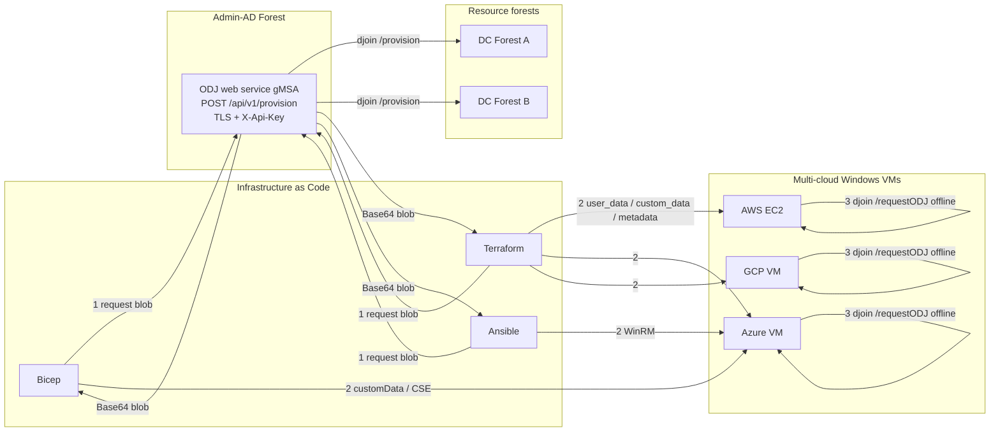
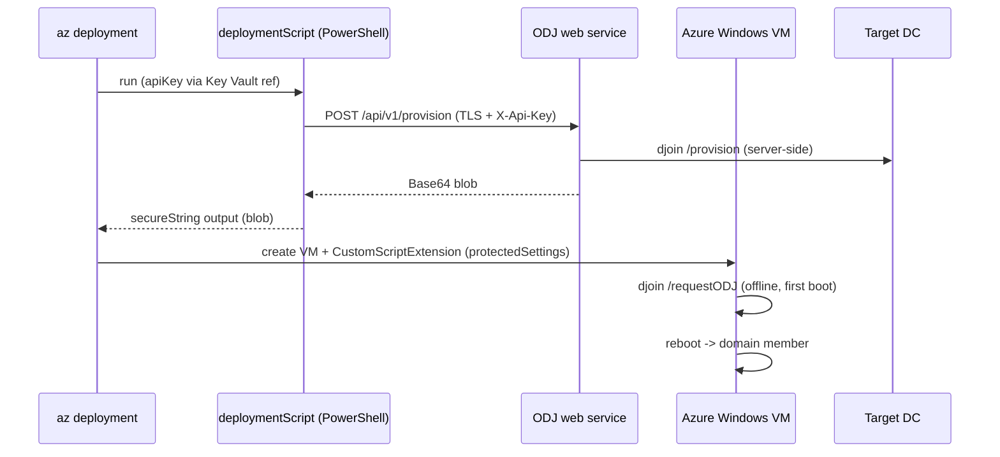
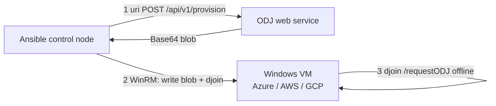

# Multi-Cloud VMs with Bicep, Terraform and Ansible

> Languages / Sprachen: **English** (this file) &middot; [Deutsch](multi-cloud.md)
>
> Back to: [README.en.md](README.en.md) (EN) &middot; [../README.md](../README.md) (DE)

This guide shows how to drive the **CrossForestOfflineJoin** web service from
common Infrastructure-as-Code (IaC) tools to domain-join **Windows VMs across
Azure, AWS and GCP** — offline, without credentials on the target and without
the double-hop problem.

VMware is only one delivery channel (see the main README). Because the join is
applied **offline** on the target, the very same `POST /api/v1/provision` REST
call works for any cloud: the only thing that changes is *how the Base64 blob is
delivered into the VM's first-boot bootstrap*.

## The common pattern

Every integration below follows the same three steps:

1. **Request** the ODJ blob from the web service over TLS with an `X-Api-Key`
   header (`machineName`, `domain`, `outputFormat = blob`). The service creates
   the computer account server-side and returns a Base64 blob.
2. **Deliver** the blob into the VM's platform-native bootstrap channel
   (Azure `customData` / Custom Script Extension, AWS EC2 `user_data`, GCP
   `sysprep-specialize-script-ps1`, or Ansible over WinRM).
3. **Apply** the blob offline on first boot with `djoin /requestODJ` (directly or
   via [`Invoke-OfflineDomainJoinRequest.ps1`](../scripts/Invoke-OfflineDomainJoinRequest.ps1)).
   No DC contact, no credentials.



### The first-boot apply snippet

All samples inject the same self-contained PowerShell that mirrors what
[`Invoke-OfflineDomainJoinRequest.ps1`](../scripts/Invoke-OfflineDomainJoinRequest.ps1)
does — write the Base64 blob to a **Unicode** file, then run `djoin`:

```powershell
param([Parameter(Mandatory)][string]$Blob)
$ErrorActionPreference = 'Stop'
$loadFile = Join-Path $env:TEMP 'odj.tmp'
# djoin /loadfile expects a Unicode file; -NoNewline avoids a trailing byte.
Set-Content -LiteralPath $loadFile -Value $Blob -Encoding Unicode -NoNewline
& "$env:SystemRoot\System32\djoin.exe" /requestODJ /loadfile $loadFile /windowspath $env:SystemRoot /localos
if ($LASTEXITCODE -ne 0) { throw "djoin failed: $LASTEXITCODE" }
Remove-Item -LiteralPath $loadFile -Force
Restart-Computer -Force
```

> **Security.** The blob contains the machine password — treat it as a secret.
> Pass it only through **secure** IaC channels (Bicep `@secure()` parameters and
> extension `protectedSettings`, Terraform `sensitive = true` variables, Ansible
> `no_log: true`), transport over TLS only, keep it short-lived, and delete the
> temporary file after the join.

## Bicep (Azure)

Two stages. First a `deploymentScript` requests the blob from the service and
returns it as a **secure** output; then the Windows VM applies it via a Custom
Script Extension whose `protectedSettings` keep the blob encrypted at rest.



```bicep
@description('ODJ web service base URL, e.g. https://odjsvc.admin-ad.example.com:8443')
param odjServiceUrl string

@description('Target machine name to provision')
param machineName string

@description('Target domain FQDN in a resource forest')
param targetDomain string

@secure()
@description('API key for the ODJ web service (pass from Key Vault or pipeline)')
param odjApiKey string

param location string = resourceGroup().location
param adminUsername string
@secure()
param adminPassword string

// 1) Request the ODJ blob server-side and expose it as a secure output.
resource getBlob 'Microsoft.Resources/deploymentScripts@2023-08-01' = {
  name: 'get-odj-blob'
  location: location
  kind: 'AzurePowerShell'
  properties: {
    azPowerShellVersion: '11.0'
    retentionInterval: 'PT1H'
    environmentVariables: [
      { name: 'ODJ_URL', value: odjServiceUrl }
      { name: 'ODJ_MACHINE', value: machineName }
      { name: 'ODJ_DOMAIN', value: targetDomain }
      { name: 'ODJ_APIKEY', secureValue: odjApiKey }
    ]
    scriptContent: '''
      $body = @{ machineName = $env:ODJ_MACHINE; domain = $env:ODJ_DOMAIN; outputFormat = 'blob' } | ConvertTo-Json
      $resp = Invoke-RestMethod -Method Post -Uri "$($env:ODJ_URL)/api/v1/provision" `
        -Headers @{ 'X-Api-Key' = $env:ODJ_APIKEY } -Body $body -ContentType 'application/json'
      $DeploymentScriptOutputs = @{ blob = $resp.blob }
    '''
  }
}

// 2) Windows VM (NIC/OS disk omitted for brevity).
resource vm 'Microsoft.Compute/virtualMachines@2024-07-01' = {
  name: machineName
  location: location
  properties: {
    hardwareProfile: { vmSize: 'Standard_D2s_v5' }
    osProfile: {
      computerName: machineName
      adminUsername: adminUsername
      adminPassword: adminPassword
    }
    // storageProfile / networkProfile omitted for brevity
  }
}

// 3) Apply the blob offline via a Custom Script Extension (protectedSettings
//    keeps the blob encrypted at rest and off the activity log).
resource odjExtension 'Microsoft.Compute/virtualMachines/extensions@2024-07-01' = {
  parent: vm
  name: 'ApplyOfflineDomainJoin'
  location: location
  properties: {
    publisher: 'Microsoft.Compute'
    type: 'CustomScriptExtension'
    typeHandlerVersion: '1.10'
    autoUpgradeMinorVersion: true
    protectedSettings: {
      commandToExecute: 'powershell -NoProfile -ExecutionPolicy Bypass -EncodedCommand ${base64(concat('$b=\'', getBlob.properties.outputs.blob, '\';$f=Join-Path $env:TEMP \'odj.tmp\';Set-Content -LiteralPath $f -Value $b -Encoding Unicode -NoNewline;djoin /requestODJ /loadfile $f /windowspath $env:SystemRoot /localos;Remove-Item $f -Force;Restart-Computer -Force'))}'
    }
  }
}
```

> Deploy with `az deployment group create -g <rg> -f main.bicep -p odjApiKey=<key> ...`.
> Prefer a Key Vault reference for `odjApiKey` over a plaintext parameter.

## Terraform (Azure, AWS, GCP)

Terraform stays cloud-agnostic by fetching the blob **once** with the `external`
data source (a tiny helper that POSTs to the service and returns
`{"blob":"..."}`), then wiring that value into each provider's native bootstrap.

```hcl
# variables.tf
variable "odj_service_url" { type = string }
variable "odj_api_key"     { type = string, sensitive = true }
variable "machine_name"    { type = string }
variable "target_domain"   { type = string }

# 1) Request the blob from the ODJ web service (helper returns JSON on stdout).
data "external" "odj_blob" {
  program = ["pwsh", "-NoProfile", "-File", "${path.module}/get-odj-blob.ps1"]
  query = {
    url          = var.odj_service_url
    api_key      = var.odj_api_key
    machine_name = var.machine_name
    domain       = var.target_domain
  }
}

locals {
  odj_blob = data.external.odj_blob.result.blob
  # Self-contained first-boot bootstrap, base64-safe for user_data/custom_data.
  bootstrap = <<-PS
    <powershell>
    $b = '${local.odj_blob}'
    $f = Join-Path $env:TEMP 'odj.tmp'
    Set-Content -LiteralPath $f -Value $b -Encoding Unicode -NoNewline
    djoin /requestODJ /loadfile $f /windowspath $env:SystemRoot /localos
    Remove-Item $f -Force
    Restart-Computer -Force
    </powershell>
  PS
}
```

```powershell
# get-odj-blob.ps1  (Terraform external data source helper)
$ErrorActionPreference = 'Stop'
$in  = [Console]::In.ReadToEnd() | ConvertFrom-Json
$body = @{ machineName = $in.machine_name; domain = $in.domain; outputFormat = 'blob' } | ConvertTo-Json
$resp = Invoke-RestMethod -Method Post -Uri "$($in.url)/api/v1/provision" `
  -Headers @{ 'X-Api-Key' = $in.api_key } -Body $body -ContentType 'application/json'
@{ blob = $resp.blob } | ConvertTo-Json   # external data source requires a flat string map
```

**Azure** — pass the blob via a Custom Script Extension (keep it out of
`custom_data`, which is world-readable inside the VM):

```hcl
resource "azurerm_windows_virtual_machine" "vm" {
  name                = var.machine_name
  computer_name       = var.machine_name
  resource_group_name = azurerm_resource_group.rg.name
  location            = azurerm_resource_group.rg.location
  size                = "Standard_D2s_v5"
  admin_username      = "azadmin"
  admin_password      = var.admin_password
  network_interface_ids = [azurerm_network_interface.nic.id]
  # os_disk / source_image_reference omitted for brevity
}

resource "azurerm_virtual_machine_extension" "odj" {
  name                 = "ApplyOfflineDomainJoin"
  virtual_machine_id   = azurerm_windows_virtual_machine.vm.id
  publisher            = "Microsoft.Compute"
  type                 = "CustomScriptExtension"
  type_handler_version = "1.10"

  protected_settings = jsonencode({
    commandToExecute = "powershell -NoProfile -ExecutionPolicy Bypass -EncodedCommand ${base64encode(local.bootstrap)}"
  })
}
```

**AWS EC2** — the `<powershell>` block in `user_data` runs on first boot:

```hcl
resource "aws_instance" "win" {
  ami           = data.aws_ami.windows.id
  instance_type = "t3.large"
  user_data     = local.bootstrap   # already wrapped in <powershell>...</powershell>
  tags          = { Name = var.machine_name }
}
```

**GCP** — use the `sysprep-specialize-script-ps1` metadata key (runs before the
first interactive logon):

```hcl
resource "google_compute_instance" "win" {
  name         = lower(var.machine_name)
  machine_type = "e2-standard-2"
  zone         = "europe-west3-a"

  boot_disk { initialize_params { image = "windows-cloud/windows-2022" } }
  network_interface { network = "default" }

  metadata = {
    # GCP runs this once during specialize; strip the <powershell> wrapper here.
    sysprep-specialize-script-ps1 = replace(replace(local.bootstrap, "<powershell>", ""), "</powershell>", "")
  }
}
```

## Ansible

Ansible splits the flow cleanly: the control node requests the blob from the
service (`ansible.builtin.uri`), then applies it on the Windows target over
WinRM. This suits **already-running** VMs (any cloud) or a post-provision step.



```yaml
---
- name: Offline domain join a multi-cloud Windows VM
  hosts: new_windows_vms          # WinRM inventory (Azure/AWS/GCP)
  gather_facts: false
  vars:
    odj_service_url: "https://odjsvc.admin-ad.example.com:8443"
    target_domain: "res-a.example.com"
    # odj_api_key supplied via Ansible Vault or an env lookup - never in plain text

  tasks:
    - name: 1) Request the ODJ blob from the web service (on the control node)
      ansible.builtin.uri:
        url: "{{ odj_service_url }}/api/v1/provision"
        method: POST
        headers:
          X-Api-Key: "{{ odj_api_key }}"
        body_format: json
        body:
          machineName: "{{ inventory_hostname }}"
          domain: "{{ target_domain }}"
          outputFormat: "blob"
        return_content: true
      delegate_to: localhost
      register: odj
      no_log: true

    - name: 2) Write the blob to a Unicode temp file on the target
      ansible.windows.win_copy:
        content: "{{ odj.json.blob }}"
        dest: 'C:\Windows\Temp\odj.tmp'
      no_log: true

    - name: 3) Apply the blob offline with djoin
      ansible.windows.win_shell: >
        $f = 'C:\Windows\Temp\odj.tmp';
        djoin /requestODJ /loadfile $f /windowspath $env:SystemRoot /localos;
        if ($LASTEXITCODE -ne 0) { throw "djoin failed: $LASTEXITCODE" };
        Remove-Item $f -Force
      register: djoin_result

    - name: 4) Reboot into the domain
      ansible.windows.win_reboot:
```

> `win_copy` writes UTF-8 by default; `djoin /loadfile` tolerates the Base64
> text either way, but if a specific target rejects it, convert to Unicode on the
> box first (`Set-Content -Encoding Unicode`) exactly as the shipped
> [`Invoke-OfflineDomainJoinRequest.ps1`](../scripts/Invoke-OfflineDomainJoinRequest.ps1)
> does.

## Notes and caveats

- **Blob is single-use and time-sensitive.** Request it as close to first boot as
  possible; the target's hostname must match the provisioned `machineName`.
- **Secure the API key.** Use Key Vault (Bicep/Terraform on Azure), SSM/Secrets
  Manager (AWS), Secret Manager (GCP) or Ansible Vault — never a plaintext
  parameter in source control.
- **Network path.** The IaC control plane (deployment script, Terraform runner,
  Ansible control node) needs TLS reachability to the ODJ web service; the target
  VM itself does **not** need any DC or service connectivity for the offline join.
- **Allow-list still governs.** The service re-validates `machineName`/`domain`
  against its server-side allow-list regardless of which IaC tool calls it.

## References

- [Bicep documentation](https://learn.microsoft.com/azure/azure-resource-manager/bicep/)
- [Bicep deployment scripts](https://learn.microsoft.com/azure/azure-resource-manager/bicep/deployment-script-bicep)
- [Azure Custom Script Extension for Windows](https://learn.microsoft.com/azure/virtual-machines/extensions/custom-script-windows)
- [Terraform `external` data source](https://registry.terraform.io/providers/hashicorp/external/latest/docs/data-sources/external)
- [Terraform `azurerm_virtual_machine_extension`](https://registry.terraform.io/providers/hashicorp/azurerm/latest/docs/resources/virtual_machine_extension)
- [AWS EC2 Windows user data execution](https://docs.aws.amazon.com/AWSEC2/latest/WindowsGuide/ec2-windows-user-data.html)
- [GCP Windows startup/specialize scripts](https://cloud.google.com/compute/docs/instances/startup-scripts/windows)
- [Ansible `ansible.windows` collection](https://docs.ansible.com/ansible/latest/collections/ansible/windows/index.html)
- [Offline Domain Join (djoin.exe) step-by-step](https://learn.microsoft.com/previous-versions/windows/it-pro/windows-server-2008-R2-and-2008/dd392267(v=ws.10))
