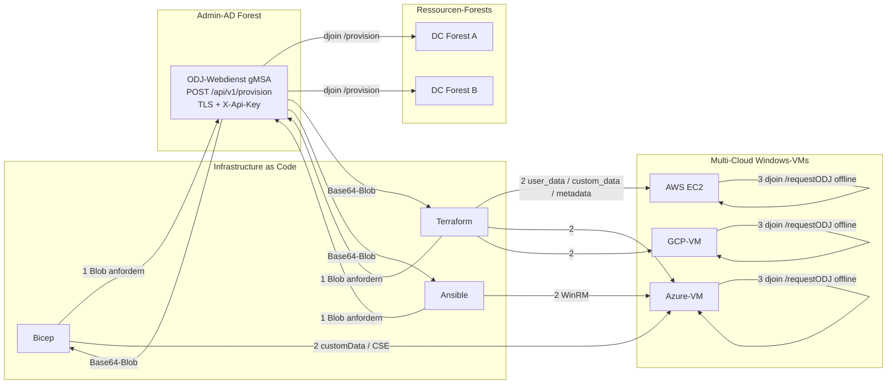
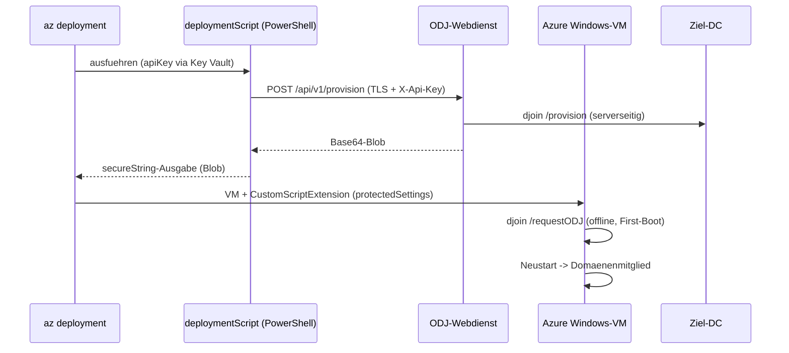
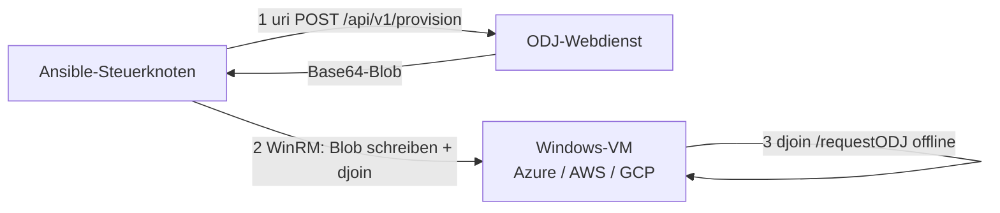

# Multi-Cloud-VMs mit Bicep, Terraform und Ansible

> Sprachen / Languages: **Deutsch** (diese Datei) &middot; [English](multi-cloud.en.md)
>
> Zurueck zu: [../README.md](../README.md) (DE) &middot; [README.en.md](README.en.md) (EN)

Diese Anleitung zeigt, wie der **CrossForestOfflineJoin**-Webdienst aus
gaengigen Infrastructure-as-Code-Werkzeugen (IaC) angesteuert wird, um
**Windows-VMs in Azure, AWS und GCP** dem Domaenenbeitritt zuzufuehren —
offline, ohne Anmeldeinformationen auf dem Ziel und ohne das Double-Hop-Problem.

VMware ist nur *ein* Auslieferungsweg (siehe Haupt-README). Da der Join
**offline** auf dem Ziel angewendet wird, funktioniert derselbe
`POST /api/v1/provision`-REST-Aufruf fuer jede Cloud: Es aendert sich lediglich,
*wie der Base64-Blob in den First-Boot der VM gelangt*.

## Das gemeinsame Muster

Jede der folgenden Anbindungen folgt denselben drei Schritten:

1. **Anfordern:** Den ODJ-Blob per TLS mit `X-Api-Key`-Header vom Webdienst
   abrufen (`machineName`, `domain`, `outputFormat = blob`). Der Dienst legt das
   Computerkonto serverseitig an und liefert einen Base64-Blob zurueck.
2. **Ausliefern:** Den Blob in den plattformnativen Bootstrap der VM schreiben
   (Azure `customData` / Custom Script Extension, AWS EC2 `user_data`, GCP
   `sysprep-specialize-script-ps1` oder Ansible ueber WinRM).
3. **Anwenden:** Den Blob beim ersten Start offline mit `djoin /requestODJ`
   anwenden (direkt oder ueber
   [`Invoke-OfflineDomainJoinRequest.ps1`](../scripts/Invoke-OfflineDomainJoinRequest.ps1)).
   Kein DC-Kontakt, keine Anmeldeinformationen.



### Der First-Boot-Anwendungs-Schnipsel

Alle Beispiele injizieren dasselbe eigenstaendige PowerShell, das nachbildet, was
[`Invoke-OfflineDomainJoinRequest.ps1`](../scripts/Invoke-OfflineDomainJoinRequest.ps1)
tut — den Base64-Blob in eine **Unicode**-Datei schreiben und dann `djoin`
ausfuehren:

```powershell
param([Parameter(Mandatory)][string]$Blob)
$ErrorActionPreference = 'Stop'
$loadFile = Join-Path $env:TEMP 'odj.tmp'
# djoin /loadfile erwartet eine Unicode-Datei; -NoNewline vermeidet ein Restbyte.
Set-Content -LiteralPath $loadFile -Value $Blob -Encoding Unicode -NoNewline
& "$env:SystemRoot\System32\djoin.exe" /requestODJ /loadfile $loadFile /windowspath $env:SystemRoot /localos
if ($LASTEXITCODE -ne 0) { throw "djoin fehlgeschlagen: $LASTEXITCODE" }
Remove-Item -LiteralPath $loadFile -Force
Restart-Computer -Force
```

> **Sicherheit.** Der Blob enthaelt das Maschinenkennwort — behandeln Sie ihn als
> Geheimnis. Geben Sie ihn nur ueber **sichere** IaC-Kanaele weiter (Bicep
> `@secure()`-Parameter und Extension-`protectedSettings`, Terraform
> `sensitive = true`-Variablen, Ansible `no_log: true`), uebertragen Sie ihn
> ausschliesslich per TLS, halten Sie ihn kurzlebig und loeschen Sie die
> temporaere Datei nach dem Join.

## Bicep (Azure)

Zwei Stufen. Zuerst fordert ein `deploymentScript` den Blob vom Dienst an und
gibt ihn als **sichere** Ausgabe zurueck; anschliessend wendet die Windows-VM ihn
ueber eine Custom Script Extension an, deren `protectedSettings` den Blob im
Ruhezustand verschluesselt halten.



```bicep
@description('Basis-URL des ODJ-Webdiensts, z. B. https://odjsvc.admin-ad.example.com:8443')
param odjServiceUrl string

@description('Zu provisionierender Maschinenname')
param machineName string

@description('Ziel-Domaenen-FQDN in einem Ressourcen-Forest')
param targetDomain string

@secure()
@description('API-Schluessel fuer den ODJ-Webdienst (aus Key Vault oder Pipeline)')
param odjApiKey string

param location string = resourceGroup().location
param adminUsername string
@secure()
param adminPassword string

// 1) Blob serverseitig anfordern und als sichere Ausgabe bereitstellen.
resource getBlob 'Microsoft.Resources/deploymentScripts@2023-08-01' = {
  name: 'get-odj-blob'
  location: location
  kind: 'AzurePowerShell'
  properties: {
    azPowerShellVersion: '11.0'
    retentionInterval: 'PT1H'
    environmentVariables: [
      { name: 'ODJ_URL', value: odjServiceUrl }
      { name: 'ODJ_MACHINE', value: machineName }
      { name: 'ODJ_DOMAIN', value: targetDomain }
      { name: 'ODJ_APIKEY', secureValue: odjApiKey }
    ]
    scriptContent: '''
      $body = @{ machineName = $env:ODJ_MACHINE; domain = $env:ODJ_DOMAIN; outputFormat = 'blob' } | ConvertTo-Json
      $resp = Invoke-RestMethod -Method Post -Uri "$($env:ODJ_URL)/api/v1/provision" `
        -Headers @{ 'X-Api-Key' = $env:ODJ_APIKEY } -Body $body -ContentType 'application/json'
      $DeploymentScriptOutputs = @{ blob = $resp.blob }
    '''
  }
}

// 2) Windows-VM (NIC/OS-Disk der Kuerze halber ausgelassen).
resource vm 'Microsoft.Compute/virtualMachines@2024-07-01' = {
  name: machineName
  location: location
  properties: {
    hardwareProfile: { vmSize: 'Standard_D2s_v5' }
    osProfile: {
      computerName: machineName
      adminUsername: adminUsername
      adminPassword: adminPassword
    }
    // storageProfile / networkProfile ausgelassen
  }
}

// 3) Blob offline per Custom Script Extension anwenden (protectedSettings haelt
//    den Blob verschluesselt und aus dem Aktivitaetsprotokoll heraus).
resource odjExtension 'Microsoft.Compute/virtualMachines/extensions@2024-07-01' = {
  parent: vm
  name: 'ApplyOfflineDomainJoin'
  location: location
  properties: {
    publisher: 'Microsoft.Compute'
    type: 'CustomScriptExtension'
    typeHandlerVersion: '1.10'
    autoUpgradeMinorVersion: true
    protectedSettings: {
      commandToExecute: 'powershell -NoProfile -ExecutionPolicy Bypass -EncodedCommand ${base64(concat('$b=\'', getBlob.properties.outputs.blob, '\';$f=Join-Path $env:TEMP \'odj.tmp\';Set-Content -LiteralPath $f -Value $b -Encoding Unicode -NoNewline;djoin /requestODJ /loadfile $f /windowspath $env:SystemRoot /localos;Remove-Item $f -Force;Restart-Computer -Force'))}'
    }
  }
}
```

> Bereitstellen mit `az deployment group create -g <rg> -f main.bicep -p odjApiKey=<key> ...`.
> Bevorzugen Sie fuer `odjApiKey` eine Key-Vault-Referenz statt eines
> Klartextparameters.

## Terraform (Azure, AWS, GCP)

Terraform bleibt cloud-neutral, indem der Blob **einmalig** ueber die
`external`-Datenquelle abgerufen wird (ein kleiner Helfer, der an den Dienst
POSTet und `{"blob":"..."}` zurueckgibt); dieser Wert wird dann in den nativen
Bootstrap jedes Providers eingespeist.

```hcl
# variables.tf
variable "odj_service_url" { type = string }
variable "odj_api_key"     { type = string, sensitive = true }
variable "machine_name"    { type = string }
variable "target_domain"   { type = string }

# 1) Blob vom ODJ-Webdienst anfordern (Helfer gibt JSON auf stdout aus).
data "external" "odj_blob" {
  program = ["pwsh", "-NoProfile", "-File", "${path.module}/get-odj-blob.ps1"]
  query = {
    url          = var.odj_service_url
    api_key      = var.odj_api_key
    machine_name = var.machine_name
    domain       = var.target_domain
  }
}

locals {
  odj_blob = data.external.odj_blob.result.blob
  # Eigenstaendiger First-Boot-Bootstrap, base64-tauglich fuer user_data/custom_data.
  bootstrap = <<-PS
    <powershell>
    $b = '${local.odj_blob}'
    $f = Join-Path $env:TEMP 'odj.tmp'
    Set-Content -LiteralPath $f -Value $b -Encoding Unicode -NoNewline
    djoin /requestODJ /loadfile $f /windowspath $env:SystemRoot /localos
    Remove-Item $f -Force
    Restart-Computer -Force
    </powershell>
  PS
}
```

```powershell
# get-odj-blob.ps1  (Helfer fuer die Terraform-external-Datenquelle)
$ErrorActionPreference = 'Stop'
$in  = [Console]::In.ReadToEnd() | ConvertFrom-Json
$body = @{ machineName = $in.machine_name; domain = $in.domain; outputFormat = 'blob' } | ConvertTo-Json
$resp = Invoke-RestMethod -Method Post -Uri "$($in.url)/api/v1/provision" `
  -Headers @{ 'X-Api-Key' = $in.api_key } -Body $body -ContentType 'application/json'
@{ blob = $resp.blob } | ConvertTo-Json   # external-Datenquelle erwartet eine flache String-Map
```

**Azure** — Blob per Custom Script Extension uebergeben (nicht ueber
`custom_data`, das innerhalb der VM lesbar ist):

```hcl
resource "azurerm_windows_virtual_machine" "vm" {
  name                = var.machine_name
  computer_name       = var.machine_name
  resource_group_name = azurerm_resource_group.rg.name
  location            = azurerm_resource_group.rg.location
  size                = "Standard_D2s_v5"
  admin_username      = "azadmin"
  admin_password      = var.admin_password
  network_interface_ids = [azurerm_network_interface.nic.id]
  # os_disk / source_image_reference der Kuerze halber ausgelassen
}

resource "azurerm_virtual_machine_extension" "odj" {
  name                 = "ApplyOfflineDomainJoin"
  virtual_machine_id   = azurerm_windows_virtual_machine.vm.id
  publisher            = "Microsoft.Compute"
  type                 = "CustomScriptExtension"
  type_handler_version = "1.10"

  protected_settings = jsonencode({
    commandToExecute = "powershell -NoProfile -ExecutionPolicy Bypass -EncodedCommand ${base64encode(local.bootstrap)}"
  })
}
```

**AWS EC2** — der `<powershell>`-Block in `user_data` laeuft beim ersten Start:

```hcl
resource "aws_instance" "win" {
  ami           = data.aws_ami.windows.id
  instance_type = "t3.large"
  user_data     = local.bootstrap   # bereits in <powershell>...</powershell> eingefasst
  tags          = { Name = var.machine_name }
}
```

**GCP** — den Metadaten-Schluessel `sysprep-specialize-script-ps1` verwenden
(laeuft vor der ersten interaktiven Anmeldung):

```hcl
resource "google_compute_instance" "win" {
  name         = lower(var.machine_name)
  machine_type = "e2-standard-2"
  zone         = "europe-west3-a"

  boot_disk { initialize_params { image = "windows-cloud/windows-2022" } }
  network_interface { network = "default" }

  metadata = {
    # GCP fuehrt dies einmal beim Specialize aus; hier die <powershell>-Klammer entfernen.
    sysprep-specialize-script-ps1 = replace(replace(local.bootstrap, "<powershell>", ""), "</powershell>", "")
  }
}
```

## Ansible

Ansible trennt den Ablauf sauber: Der Steuerknoten fordert den Blob vom Dienst
an (`ansible.builtin.uri`) und wendet ihn dann ueber WinRM auf dem Windows-Ziel
an. Das eignet sich fuer **bereits laufende** VMs (jede Cloud) oder als
Post-Provisioning-Schritt.



```yaml
---
- name: Offline-Domaenenbeitritt einer Multi-Cloud-Windows-VM
  hosts: new_windows_vms          # WinRM-Inventar (Azure/AWS/GCP)
  gather_facts: false
  vars:
    odj_service_url: "https://odjsvc.admin-ad.example.com:8443"
    target_domain: "res-a.example.com"
    # odj_api_key via Ansible Vault oder env-Lookup - niemals im Klartext

  tasks:
    - name: 1) ODJ-Blob vom Webdienst anfordern (auf dem Steuerknoten)
      ansible.builtin.uri:
        url: "{{ odj_service_url }}/api/v1/provision"
        method: POST
        headers:
          X-Api-Key: "{{ odj_api_key }}"
        body_format: json
        body:
          machineName: "{{ inventory_hostname }}"
          domain: "{{ target_domain }}"
          outputFormat: "blob"
        return_content: true
      delegate_to: localhost
      register: odj
      no_log: true

    - name: 2) Blob in eine Unicode-Temp-Datei auf dem Ziel schreiben
      ansible.windows.win_copy:
        content: "{{ odj.json.blob }}"
        dest: 'C:\Windows\Temp\odj.tmp'
      no_log: true

    - name: 3) Blob offline mit djoin anwenden
      ansible.windows.win_shell: >
        $f = 'C:\Windows\Temp\odj.tmp';
        djoin /requestODJ /loadfile $f /windowspath $env:SystemRoot /localos;
        if ($LASTEXITCODE -ne 0) { throw "djoin fehlgeschlagen: $LASTEXITCODE" };
        Remove-Item $f -Force
      register: djoin_result

    - name: 4) In die Domaene neu starten
      ansible.windows.win_reboot:
```

> `win_copy` schreibt standardmaessig UTF-8; `djoin /loadfile` toleriert den
> Base64-Text ohnehin. Weist ein bestimmtes Ziel ihn zurueck, wandeln Sie ihn auf
> dem Rechner erst in Unicode um (`Set-Content -Encoding Unicode`), genau wie es
> das mitgelieferte
> [`Invoke-OfflineDomainJoinRequest.ps1`](../scripts/Invoke-OfflineDomainJoinRequest.ps1)
> tut.

## Hinweise und Fallstricke

- **Blob ist einmalig und zeitkritisch.** Fordern Sie ihn moeglichst nah am
  First-Boot an; der Hostname des Ziels muss dem provisionierten `machineName`
  entsprechen.
- **API-Schluessel absichern.** Nutzen Sie Key Vault (Bicep/Terraform auf Azure),
  SSM/Secrets Manager (AWS), Secret Manager (GCP) oder Ansible Vault — niemals
  einen Klartextparameter in der Versionsverwaltung.
- **Netzwerkpfad.** Die IaC-Steuerungsebene (deployment script, Terraform-Runner,
  Ansible-Steuerknoten) benoetigt TLS-Erreichbarkeit zum ODJ-Webdienst; die
  Ziel-VM selbst braucht fuer den Offline-Join **keine** DC- oder
  Dienst-Konnektivitaet.
- **Positivliste gilt weiterhin.** Der Dienst validiert `machineName`/`domain`
  serverseitig gegen seine Positivliste neu, unabhaengig davon, welches
  IaC-Werkzeug ihn aufruft.

## Referenzen

- [Bicep-Dokumentation](https://learn.microsoft.com/azure/azure-resource-manager/bicep/)
- [Bicep Deployment Scripts](https://learn.microsoft.com/azure/azure-resource-manager/bicep/deployment-script-bicep)
- [Azure Custom Script Extension fuer Windows](https://learn.microsoft.com/azure/virtual-machines/extensions/custom-script-windows)
- [Terraform `external`-Datenquelle](https://registry.terraform.io/providers/hashicorp/external/latest/docs/data-sources/external)
- [Terraform `azurerm_virtual_machine_extension`](https://registry.terraform.io/providers/hashicorp/azurerm/latest/docs/resources/virtual_machine_extension)
- [AWS EC2 Windows User-Data-Ausfuehrung](https://docs.aws.amazon.com/AWSEC2/latest/WindowsGuide/ec2-windows-user-data.html)
- [GCP Windows Startup-/Specialize-Skripte](https://cloud.google.com/compute/docs/instances/startup-scripts/windows)
- [Ansible `ansible.windows`-Collection](https://docs.ansible.com/ansible/latest/collections/ansible/windows/index.html)
- [Offline Domain Join (Djoin.exe) Step-by-Step](https://learn.microsoft.com/previous-versions/windows/it-pro/windows-server-2008-R2-and-2008/dd392267(v=ws.10))
