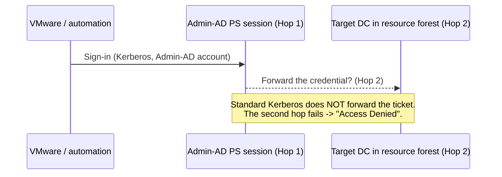
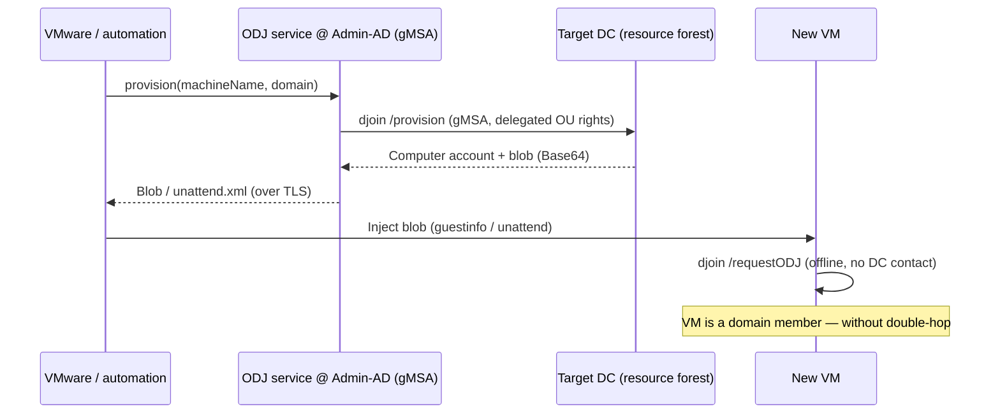

# Solution Variants: Cross-Forest VM Domain Join

Author: Jan Tiedemann

> Languages / Sprachen: **English** (this file) &middot; [Deutsch](loesungsvarianten.md)

This document describes the possible solution paths for the problem of joining
new VMware VMs into multiple trusted resource forests from a central Admin-AD
forest — including an assessment of the double-hop problem.

## Starting point

- Multiple AD forests (resource forests) and one central **Admin-AD forest**.
- **Forest trusts** exist between Admin-AD and the resource forests.
- VMware (or its automation) authenticates with an **Admin-AD account** to a
  **PowerShell session on an Admin-AD server** and should join new VMs into the
  respective target domain from there.

## The double-hop problem

In a remote PowerShell session the credential only reaches the first server
(Admin-AD). A further network access from there to a target DC (second hop) has,
by default, **no delegatable credentials** — this is the classic double-hop
problem.

## Variant comparison

| Variant | Solves double-hop | Cross-forest capable | Security | Recommendation |
|---------|-------------------|----------------------|----------|----------------|
| CredSSP | Yes (unclean) | Yes | Weak (credential exposure at 2nd hop) | No |
| Kerberos Constrained Delegation (KCD) | Partially | No (domain-bound) | Medium | No |
| Resource-Based Constrained Delegation (RBCD) | Yes | Yes (with trust, complex) | Good | Only if an interactive remote join is mandatory |
| **Offline Domain Join (djoin/ODJ)** | **Eliminated by design** | **Yes** | **Very good** | **Yes (baseline)** |
| **ODJ + web service (gMSA)** | **Eliminated by design** | **Yes** | **Very good** | **Yes (target architecture)** |

### Variant A — CredSSP (not recommended)

CredSSP delegates the (clear-text-equivalent) credentials to the second hop.
This makes the remote join work, but the admin account's credentials are exposed
on the second server — a high risk (credential theft, pass-the-hash follow-on
scenarios). **Do not use.**

### Variant B — Kerberos Constrained Delegation (KCD)

Classic service-side configured delegation. Historically **domain-bound** and
therefore **not** usable across forest boundaries. Unsuitable for a multi-forest
scenario.

### Variant C — Resource-Based Constrained Delegation (RBCD)

RBCD is configured on the **resource side** (`msDS-Allowed`
`ToActOnBehalfOfOtherIdentity` / `PrincipalsAllowedToDelegateToAccount`). It
works across domains and, with trusts, also across forests (S4U2Proxy over the
trust), but it is complex to manage and still designed for an **interactive
impersonation join**. Choose it only if a real remote join with user context is
strictly required.

### Variant D — Offline Domain Join (recommended baseline)

`djoin.exe /provision` **decouples** the two steps:

1. **Account creation (needs DC access):** runs **locally on the Admin-AD
   server** under the **own identity** of the executor (ideally a gMSA). Via the
   cross-forest OU delegation this identity may create a computer account in the
   target OU. This is a **single hop** — no forwarding of user credentials.
2. **Application on the VM (no DC needed):** the generated Base64 blob is
   transported **out-of-band** to the VM and applied there with
   `djoin /requestODJ` (or via unattend.xml). The VM contacts **no DC** and
   needs **no credentials**.

**This eliminates the double-hop problem entirely**, because at no point are
user credentials forwarded across a second hop.

### Variant E — ODJ as a web service with gMSA (target architecture)

Variant D is wrapped in a **REST web service** (see
`src/WebService/Start-OfflineJoinService.ps1`). The service runs under a **gMSA**
and offers exactly one endpoint `POST /api/v1/provision`.

Advantages:

- **No double-hop:** the service uses its **own** identity, not the caller's.
  No delegation of user credentials takes place.
- **Least privilege:** the gMSA only has the right to create computer accounts
  in the delegated target OUs — nothing else.
- **Clean VMware integration:** vRealize/Aria Automation calls the API and
  injects the blob via `guestinfo` or unattend.xml into the new VM.
- **Governance:** allow-list, API key auth over TLS, audit log, input validation
  (injection protection).

## Recommendation

1. **Baseline:** Offline Domain Join (djoin) instead of an interactive remote
   join.
2. **Target architecture:** provide the ODJ operation as a **gMSA web service**
   and authorize the target OUs per resource forest via delegation.
3. **RBCD** only as a fallback if a real interactive remote join with user
   context is unavoidable.
4. **CredSSP** is explicitly **not** recommended.

## Security notes on the blob

- The ODJ blob contains the **machine password** — it is a **secret**.
- Transport over **TLS** only, keep it **short-lived**, securely delete
  temporary files.
- Strictly validate account names and OUs (allow-list) to prevent abuse.

## See Also

- [README.en.md](README.en.md)
- [loesungsvarianten.md](loesungsvarianten.md)
- [Microsoft Learn: Offline Domain Join (djoin)](https://learn.microsoft.com/windows-server/identity/ad-ds/deploy/offline-domain-join--djoin--step-by-step)
- [Microsoft Learn: Resource-Based Constrained Delegation](https://learn.microsoft.com/windows-server/security/kerberos/kerberos-constrained-delegation-overview)
